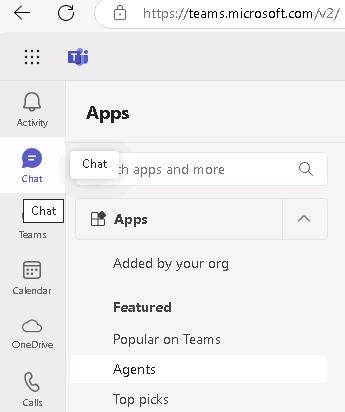
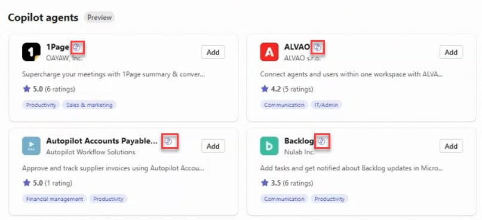

# Task 01: Search for agents in the app catalog

## Introduction
Best For You Organics’s service desk spends hours hunting for information spread across disconnected tools. By standardising on Microsoft 365 and Copilot agents, the team can find answers in one place and lower support costs.

## Description
In this task you will sign in to Microsoft Teams and open the Agents section to view a list of the pre‑built Copilot agents that are available for installation.

## Success criteria
  - Teams is open and you are signed in with the lab account.
  - Agents lists available Copilot‑ready agents.

## Key tasks

### 01: Open the agent catalog

 
  
<strong>Expand this section to view the solution</strong>
 

   {: .important } 
   > You can get started whether you're using Teams or the Microsoft 365 portal. Both platforms feature a section called Apps, where you can explore a catalog of applications available in the store.  
   > 
   > This includes apps published internally by your company as well as those offered by ISVs and partners, designed to seamlessly connect your services with the Microsoft 365 ecosystem. 

 
1. Open a browser, go to [MS Teams](https://teams.microsoft.com/) and sign in with your credentials. 

1. On the left pane, select **Apps** > **Featured** > **Agents** to view all the apps that support Copilot. 

	

    >[!note] Apps that support Copilot are marked with a small Copilot logo, indicating that the application extends Copilot's functionality. 
    > 
     

