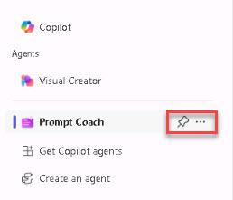

# Task 2 - Install the *Prompt Coach* agent from the app catalog

Installing an agent is straightforward, similar to installing an application in Teams or Microsoft 365. Microsoft developed several agents to enhance customer experiences, including specialized *coaches* designed to improve performance in specific areas. Examples include the Idea Coach for brainstorming and the Learning Coach for upskilling technical skills.

1. On the Copilot Agents page, explore and review the following agents to gain a better understanding of the capabilities of these specialized coaches:

    - **Idea Coach**
    - **Learning Coach**

1. Find and select the **Prompt Coach** agent.

1. Review the tabs and information and then select **Add** to install the agent. 

    {: .note }
    > Within seconds, the agent will be added. You'll then see an Open in Copilot button, which launches the Copilot experience in focus mode, centered specifically on the agent you just installed.

1. Once the agent us is successfully added, select **Open in Copilot**.

    

1. Notice the title, suggested prompts, and the agents list. 

    

1. In the right pane of Copilot, you can view a list of all available agents. To use an agent, select one, such as **Prompt Coach**, to enter the focused experience.

    {: .important }
    > In this mode, the Copilot UI is replaced with the agent's logo, name, and specific prompt starters that you can use. From this point, all interactions will be managed by the agent. For example, if you ask, *Help me generate a prompt to be used in Copilot* the agent will utilize its predefined instructions, knowledge, and actions to provide a tailored response.

1. The agent can be managed from the rightmost pane. Hover over the agent to reveal the pin and the ellipsis (...):

    - Pin: Allows you to pin the agent, making it readily accessible in the list of available agents.
    - Ellipsis (...): Provides options such as uninstalling the agent to remove it.

    
