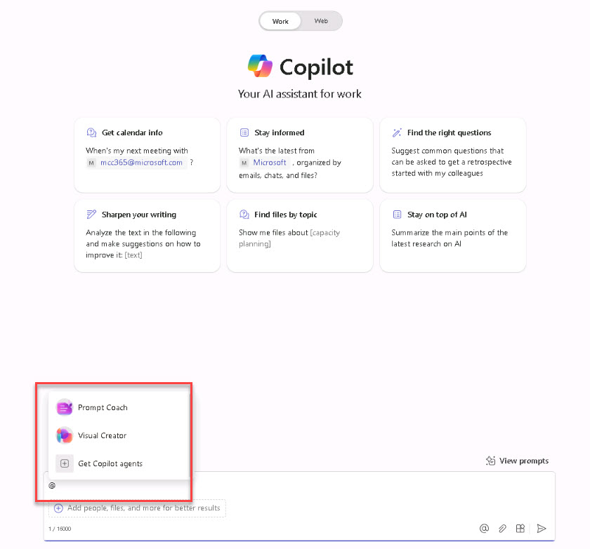

# Task 03: Use the *Prompt Coach* agent 

## Introduction

Even with Prompt Coach installed, employees still need to practise good prompting habits. By actively using the agent they can receive instant feedback and iterate on their prompts.

## Description

In this task you will open the Prompt Coach Copilot agent, submit a sample project‑related prompt, review the feedback suggestions and refine the prompt to meet Best For You Organics’s style guidelines.

## Success criteria

 - Prompt Coach chat opens successfully in Copilot.
 - The agent returns critique and improvement suggestions for the submitted prompt.
 - A revised prompt is accepted by Prompt Coach without further warnings.

## Key steps

### 01: Launch Prompt Coach

<details markdown="block"> 
  <summary><strong>Expand this section to view the solution</strong></summary> 

1. From the suggested prompts, select the **Prompt Engineering** tile. This will populate the prompt field with *How do I write a good prompt?*. Press **Enter** on your keyboard to submit the prompt.

1. Review the response for helpful tips on crafting effective prompts.

1. For a more interactive experience, select **+ New Chat** in the top-right corner of the page, then choose the **Analyze Prompt** tile and press **Enter**.

1. Review the response, then enter the following into the prompt and press **Enter**:

    ```
    Summarize my mails
    ```

1. Review the response and note that it includes an improved prompt with suggestions indicating that the original prompt was too generic and lacked essential details to effectively locate the desired information.

    {: .note }
    > The feedback highlighted that the initial prompt was vague, while the improved prompt provides significantly greater clarity. 

1. The alternative approach is to use context mode. In the rightmost pane, select **Copilot** to switch from the **Prompt Coach** agent to the Copilot agent.

    {: .important }
    > This approach is highly effective for managing complex conversations between Copilot and your agent, as it allows you to retain the context of the broader conversation while interacting with the agent.

1. To demonstrate this concept, in the Copilot prompt, enter the following text and press **Enter**:

    ```
    Give me some information about the Tech Connect event
    ```

1. Review the response. A prompt that utilizes the basic Copilot experience will be grounded in all the information available from your organization.

1. This time, let's try using context mode. We’ll You’ll use the agent to perform a specific task.

1. From the prompt, enter **@** to open the panel displaying all available agents. Select an agent to transfer the context directly to it.

    

1. Select **Prompt Coach** from the list of agents.

1. Enter the following and press **Enter**:

    ```
    Help me to craft a better prompt to find resources related to the Tech Connect Live event in Ireland
    ```

    {: .important }
    > This approach enables you to handle complex scenarios by seamlessly navigating between multiple agents as needed. 
    > 
    > Starting with the basic experience, you can forward the context to an agent to complete a specific task. Upon returning to the basic experience, you have the option to involve another agent, allowing you to continue the workflow efficiently.

</details>