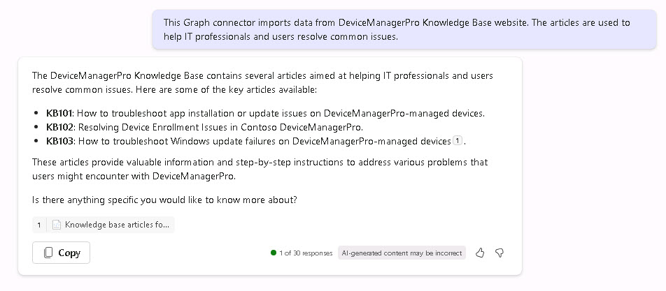

# Task 03: Try a Copilot prompt

We want to get started with this new data source, we're going to ask Copilot to suggest the prompts that we should follow up with.


1. On the left pane, select **Copilot**.

1. Enter the following prompt:

	```
 	Based on the content of the DeviceManagerPro knowledge base, suggest five Copilot prompts that demonstrate Copilot's ability to reason across data and provide valuable insights or relevant content.
 	```

	

1. Review the five suggestions.

1. From the output of the previous prompt, enter the first option:

	```
 	What are the common causes and solutions for device enrollment issues in Contoso DeviceManagerPro?
 	```
   {: .important }
   > The prompt requests a step by step guide on how to troubleshoot app installation or update issues. It's giving us several references there to help us troubleshoot issues, and it's giving us a pointer back to the Knowledge Base article that it's getting from the Graph connector.

1. Review the results.

1. Enter the following prompt summarize device enrollment issues and highlight recurring problems:

	```
 	Summarize the key steps to resolve device enrollment issues in Contoso DeviceManagerPro and highlight any patterns or recurring problems.
 	```

1. Review the results.

1. Finally, enter the following prompt to draft an email summarizing the articles, with a ranking of severity:

	```
 	Please draft an email to my manager summarizing the DeviceMangerPro Knowledge base articles, include a ranking of severity as either High, Medium or Low.
 	```
