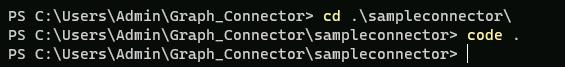
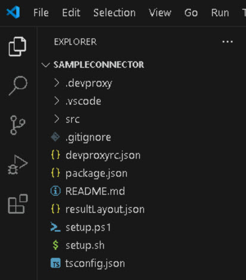

# Task 01 - Prepare the environment

1. On the Virtual Machine Windows taskbar, right-click **Start** (Windows icon), and select **Terminal (Admin)** to open a PowerShell session with Admin priviledges.

   {: .note }
   > Select **Yes** to allow the Terminal app to make changes to your device.

1. On the PowerShell prompt, to install the *create-graph-connector* package run the following command:

   ```
   npm i - create-graph-connector
   ```

   {: .note }
   > This command will install the package which contains tools that will be made available to the system.

1. Change to the **Graph_Connector** directory by enter the following:

   ```
   cd Graph_Connector
   ```

1. To begin creating the project, run the following:

   ```
   npm create graph-connector
   ```

1. Install any needed packages.

1. Complete the *create-graph-connector* project creation wizard by entering the following:
   
   | Item | Value |
   |:---------|:---------|
   | Project name:   | **sampleconnector**   |
   | Graph connector name:   | **Sample Connector**   |
   | Graph connector description:   | **Imports data from Contoso app**   |
   | Connection ID (between 3 and 32 chars):   | **sampleconnector**   |
   | Template   | **TypeScript (basic)**   |

     

1. Change directory into the newly created project directory by entering the following:

   ```
   cd .\sampleconnector\
   ```

1. Now open Visual Studio Code (VSCode) using the command below, to view the basic building blocks of a Graph connector:

   ```
   code .
   ```

   

1. A new VSCode window will open. Select **Yes, I trust the authors**. Ignore any other pop-up windows.

   

1. In VSCode, on the left menu, select **Explorer** to view the **SAMPLECONNECTOR** files.

   

   {: .important }
   > The project that gets created by the template creator is based on TypeScript. All of the code that supports the custom connector is built with TypeScript.
   > However, you are not constrained to using TypeScript when creating Graph connectors, you can use any technology that's able to perform HTTP calls.
   > Examples of other technologies can be reviewed here: [Graph-Connectors-Samples](https://github.com/pnp/graph-connectors-samples "Graph-Connectors-Samples") and more information on Graph connectors can be found here: [Connectors Gallery](https://learn.microsoft.com/en-us/microsoftsearch/connectors-gallery "Connectors Gallery").
