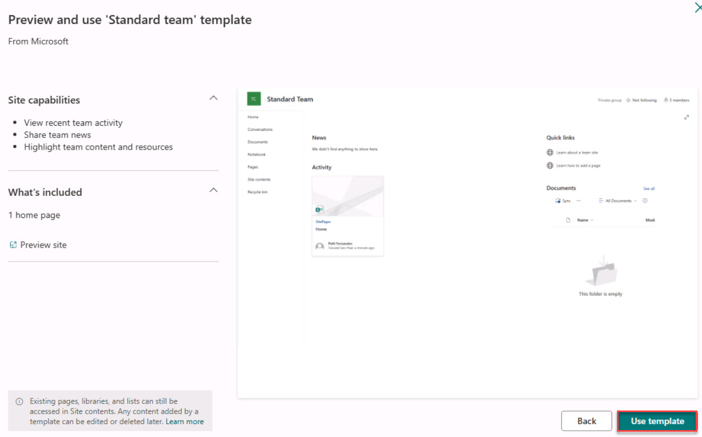

# Task 01: Create a SharePoint site 

## Introduction
Project documents at Best For You Organics are scattered across personal drives, slowing decision‑making. A dedicated SharePoint site will centralise deadline‐related artifacts for Copilot to reason over.

## Description
In this task you will provision a SharePoint team site named Project Deadlines and upload three sample Word documents, creating a central library that the Copilot agent can later query for deadline information.

## Success criteria
 - Project Deadlines SharePoint team site is created.
 - TaskMaster Pro.docx, CodeFusion AI.docx and HealthSync 360.docx are uploaded to Documents.

## Key steps

### 01: Create the SharePoint site

 
  
<strong>Expand this section to view the solution</strong>
 

1. Open a browser, go to **www.Office.com** and sign in with your credentials. 

1. On the left pane, select **Apps** and then to the right of the page, select **All apps**.  

1. On the **All apps** page, select **SharePoint**.  

1. Select **+ Create site**. 

     

1. Select **Team site**. 

     

1. On the **Select a template** page, under **From Microsoft**, select **Standard team**.  

     

1. Review the template settings and select **Use template**. 

     

1. Under **Site name**, enter **Project Deadlines**. 

1. Keep the remaining defaults and select **Next**. 

1. Select **Create site** to begin the creation process. 

1. Don’t add any users. Select **Finish**. 

     

### 02: Upload sample files 

 
  
<strong>Expand this section to view the solution</strong>
 

1. On the **Project Deadline** home page, on the left pane, select **Documents**.  

     

1. On the menu, select **Upload**, then select **Files** and upload the three sample documents. 

    {: .warning }
    > If you’re using the Skillable environment, open **File Explorer** and go to C:\Users\Admin\Downloads. Extract the **artifacts.zip** to access the three sample documents.
    >
    > If you’re not using the Skillable environment, you should have downloaded three sample documents [from GitHub](../../media/artifacts.zip) for use in this lab. **TaskMaster Pro.docx**, **CodeFuson AI.docx** and **HealthSync 360.docx**. 

1. Once the upload is complete, return to the home page by select the **Home** icon in the top left.

1. At the upper left of the page, select **Share** and then select **Copy Link to page**. 

	

    - If you’re using the Skillable environment, enter the URL here: @lab.TextBox(URL). 

    - If you’re using the Github instructions you can use Notepad, be prepared to manually enter this URL wherever the SharePoint URL is required. 

    {: .important }
    > Entering the URL in the text box will generate a token, making it easily accessible throughout the rest of the lab.  

    {: .note }
    > It should be something like **https://m365cpi########.sharepoint.com/sites/ProjectDeadlines/**.

