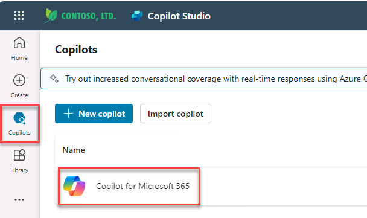
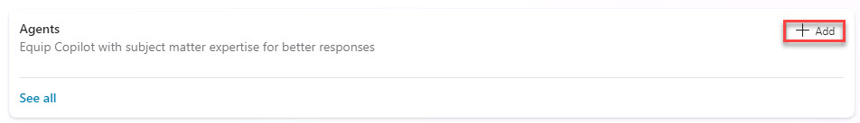
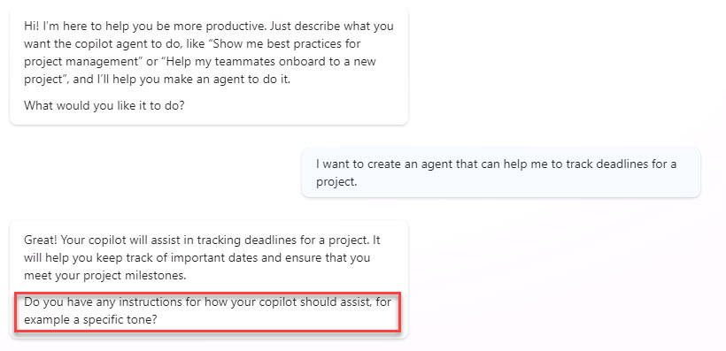
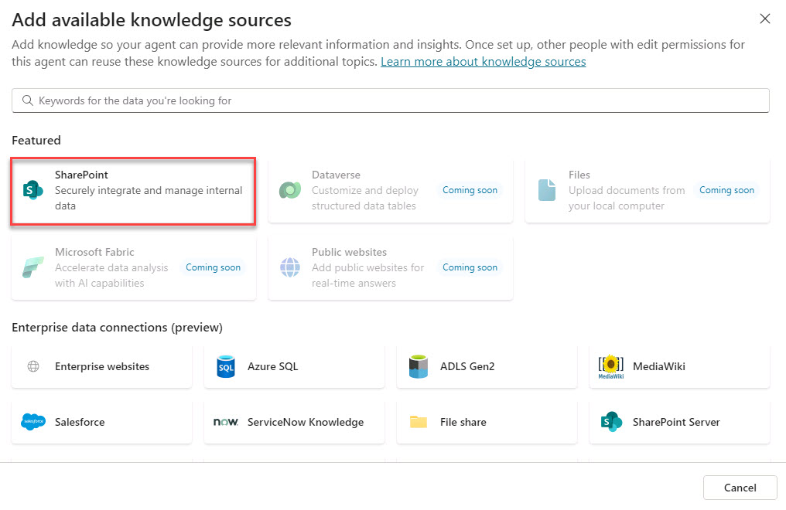
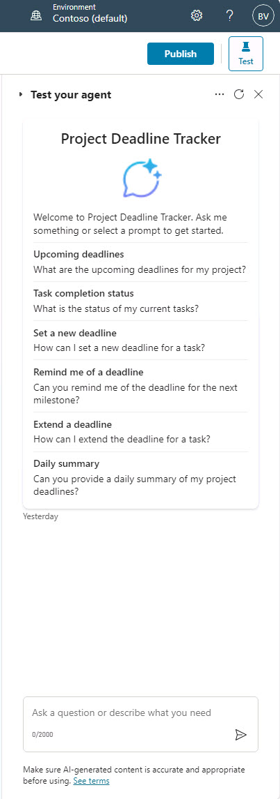
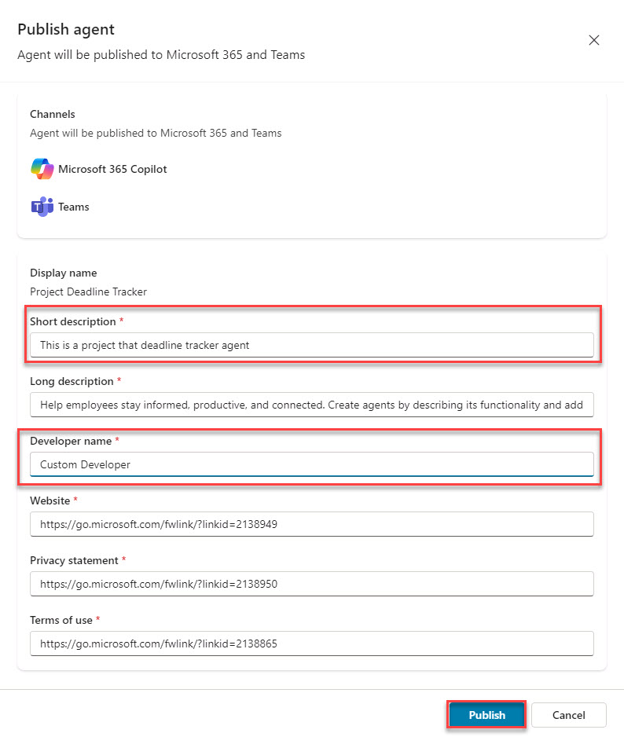
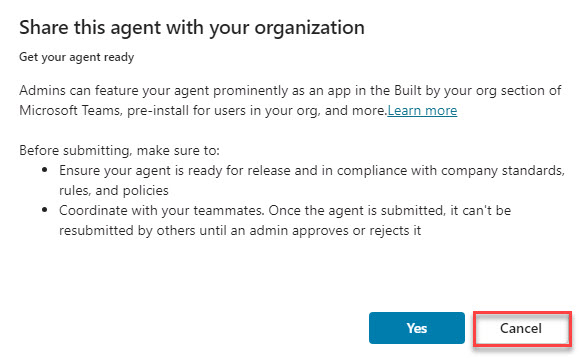
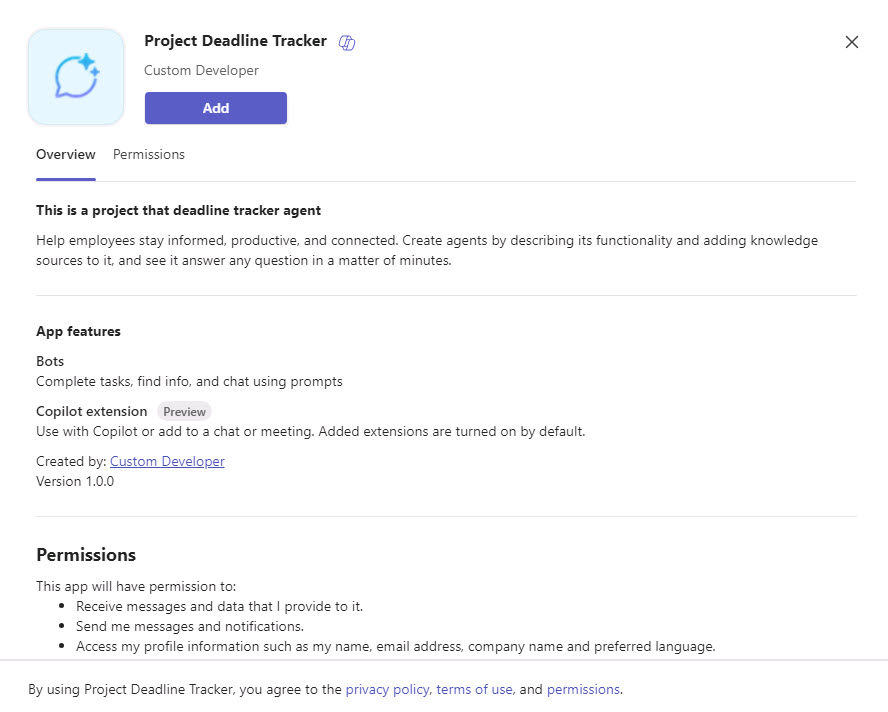
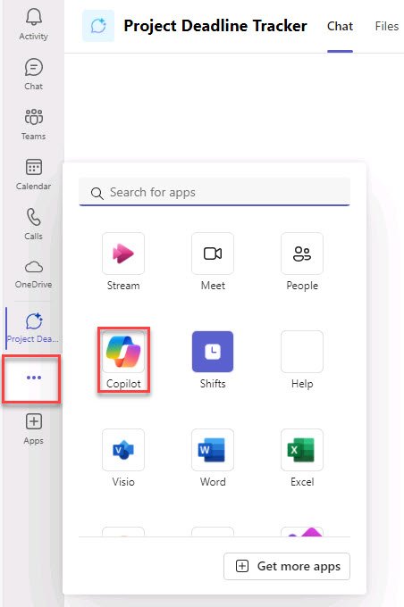
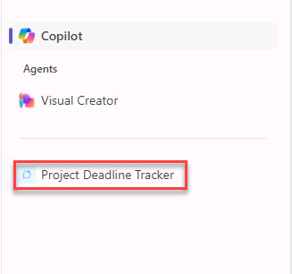

# Task 02 - Build and install the declarative agent in Copilot Studio

### View available Copilot agents in the Microsoft Teams store 

 
1. Open a browser and go to **https://teams.microsoft.com/v2/** and sign in with your credentials. 

1. In the Teams web client, on the left pane, select **Apps** and under **Featured**, select **Copilot agents**. 

1. Review the Copilot agents that are available in the tenant. 

    {: .note }
    > This can also be accomplished in the Microsoft 365 portal. 

### Build and install the agent 

1. Open a new browser tab and go to **www.copilotstudio.com** and sign in with your credentials. 

1. On the left pane, select **Copilots**. 

1. Select **Copilot for Microsoft 365**. 

     

    {: .note }
    > Notice the section called **Agents**, this is our starting point. 

1. In the **Agents** section, select **Add**. 

     

    {: .note }
    > In the **Agents** section of Copilot Studio, you’ll find two options in the upper-right corner to configure your agent, allowing for flexibility based on your preference: 
    > 
    > **Conversational Configuration**:  
    > Select this option to leverage a guided, conversational experience. Here, you can simply describe what you’d like to create, and Copilot Studio will automatically populate the necessary fields and properties based on your input. 
    > 
    > **Skip to Configuration**:  
    > Choose this option to bypass the guided setup and jump directly to the configuration page, where you can manually enter all agent properties yourself.  
    > We’ll use the conversational approach to handle deadlines for a project. 

1. Create an agent that can help track deadlines for a project by entering the following into the prompt: 

    ```
    I want to create an agent that can help me track the software projects created by my company.  
    ``` 

    {: .note }
    > Behind the scenes, Copilot Studio gathers all the necessary information to populate the agent’s configuration automatically. With these details in place, my Copilot is now set up to efficiently track deadlines.  

1. Notice that your Copilot is asking if there are any other instructions on how your Copilot should assist, for example a specific tone? 

     

1. Respond by entering the following: 

    ```
    Please answer in a professional but simple way. 
    ``` 

    {: .note }
    > Copilot Studio is now ingesting this information to fine-tune the instructions that the declarative agent will use behind the scenes. 

1. Review the response and notice the final question. **Are there any topics or tasks this copilot shouldn't help with?** 

1. Respond by entering the following: 

    ```
    Please help only with questions around the software projects created by my company. 
    ``` 

    {: .note }
    > For example, we can ensure that this declarative agent is tailored to assist only with the specific topic we want to cover, rather than responding to any general questions that might be asked. 

1. Now that the project has been finalized, in the upper-right of the page, select **Create**.  

    {: .note }
    > Now, you'll observe how previous discussions within Copilot Studio translate into a series of configurable options and properties, collectively defining your declarative agent. Please allow a few moments for the system to compile and streamline these configurations. 

1. Notice how the conversation with the compiler Studio was translated into the **Agent name**, **Description**, **Instructions**, and **Starter prompts**: 

    - Agent name: Name of the project 

    - Description: Purpose of the project 

    - Instructions: Guidance that the declarative agent will follow when it needs to respond to the user 

    - Starter prompts: Suggested prompts that will be displayed to the user when it will open up the declarative agent 

    - Knowledge: Data used to inform and improve AI-generated responses 

    {: .important }
    > In addition to configuration, there are two other essential operations we can perform with a declarative agent: defining its knowledge base and setting up actions. 
    > 
    > Defining the knowledge base determines the types of data, files, and resources the Copilot can access to generate responses. By default, the agent uses only the model’s internal knowledge.  
    >However, we can expand its scope by allowing access to external sources, such as SharePoint sites or Graph connector sources, enhancing its ability to provide relevant insights. 
    > 
    > For instance, if you have a SharePoint site containing a document with key deadlines for the Contoso project, then by granting the agent access to this site, you can ensure it can pull in these specific project deadlines when needed. 

 
1. In the **Knowledge** section, select **+ Add knowledge**. 

    {: .important }
    > Take note of the available knowledge sources. Here, you can connect to SharePoint sites or other Graph connector sources for the declarative agent to generate responses. 
    >  
    > These sections also allow you to limit Copilot’s knowledge to specific sources, ensuring it uses only the selected information rather than all available knowledge.  
    > 
    > Once configured, permissions for this agent can be set up to reuse any added knowledge sources for different topics as needed. 

1. Select **SharePoint**. 

     

1. Under **SharePoint link**, enter the URL of the SharePoint site you created at the beginning of this exercise (specified as **@lab.Variable(URL)**), and then select **Add**. 

    {: .warning }
    > Reminder: If you stored the URL in Notepad, replace the token @lab.Variable(URL) with the actual URL of your SharePoint site. 

1. On the Add SharePoint window, select **Add**. 

    {: .note }
    > Once SharePoint is added, Copilot will use it exclusively as its data source. 

1. In the **Additional settings** section, you'll find a **Web browsing** option.  

    {: .important }
    > By toggling this on or off, you can control whether Copilot—your declarative agent—can use information from the web in its responses, in addition to its internal sources. 

1. Verify that **Web browsing** is disabled. 

1. In the **Actions** section, you can add plugins to extend Copilot's capabilities. 

    {: .note }
    > More on this feature in later labs. 

1. In the upper-right, select **Test** to test Copilot and ensure it responds appropriately. Try a few sample prompts to verify its accuracy and functionality. 

     

1. When you’re satisfied with the configuration and testing, select **Publish** in the upper-right to make the agent available in Microsoft 365 and Teams. 

1. On the **Publish agent** dialog, there are some properties that can be customized. Update the following: 

    | Item | Value | 
    |:---------|:---------| 
    | Short description   | **This is a project that deadline tracker agent**   | 
    | Developer name   | **Custom Developer**   | 

1. Select **Publish**. 

     

    {: .note }
    > The publishing process will begin, and you’ll be presented with several options to distribute and deploy your agent. 

1. In the **Availability options** dialog, under **Share link**, you can select **Copy** to send the link directly, allowing recipients to paste it into their browser to access the Teams store and download the agent. 

1. Under **User access**, select **Show to my teammates and shared users** to view sharing options for people within your organization. 

1. Review the **Share agent** dialog and then select **Cancel**. 

1. Under **User access**, select **Show to everyone in my org** to share with the entire organization. 

    {: .important }
    > Selecting the option to share with everyone triggers an approval workflow for the M365 tenant's IT administrator.  
    > 
    > The administrator will need to access the Admin Center, navigate to Integrated Apps, and locate the request to publish the agent organization-wide.  
    > 
    > Unlike other sharing options, publishing an agent to the entire organization adds it to the internal catalog, making it available across the company. 

    {: .note }
    > Shared apps can be found in **Teams**. In the left pane, go to **Apps** then select **Built for your org**. All declarative Copilots will be found here if published to the organization. 

1. Review the information in the window and select **Cancel**. 

     

1. There is also an option to upload the agent directly as a custom app into Microsoft Copilot by downloading the agent as a .zip file. Now we’ll share the link to manually install the agent on the tenant. 

1. Under **Share link**, select **Copy**. 

1. Open a new browser tab, paste the link, and visit the URL to manually install the agent on the tenant. 

1. Choose the web client of Teams.  

1. Select **Add** to add the agent. 

     

1. Once the agent is added, on the left pane, select the **View more apps** ellipsis (…), and then choose **Copilot**. 

     

1. In the right pane, confirm that the agent is listed, and select **Project Deadline Tracker**. 

     

    {: .note }
    > Your declarative agent is now ready for use. You can test the agent by asking a question that pulls data from one of your specified knowledge sources. 

1. In the prompt, enter the following: 

    ```
    I'm looking for information about TaskMaster Pro. 
    ``` 

{: .important } When creating a declarative agent with the Copilot Studio experience, there are flexible ways to begin, either through a conversational setup or direct configuration. We focused on the knowledge aspect, showing how questions can be answered based on specific data sources, rather than the entire Microsoft 365 dataset. 
> We also reviewed publishing options and briefly introduced the Actions feature, which allows further customization of a declarative agent's capabilities. 
