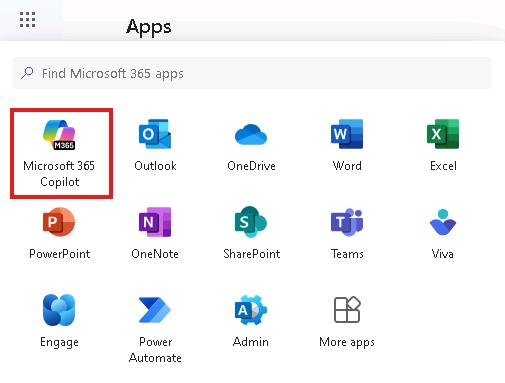

## Task 02: Build and install the declarative agent in Copilot Studio 

## Introduction

To eliminate silos, Best For You Organics will surface project‑deadline knowledge directly in Copilot via a low‑code declarative agent.

## Description

In this task you will use Copilot Studio’s conversational designer to generate a declarative agent named **Project Tracker**, configure it to ingest the Project Deadlines SharePoint site as its grounding data source, and save the agent to the tenant.

## Success criteria

 - Project Tracker agent is listed in Copilot Studio.
 - The agent opens without errors and recognises the SharePoint site as a data source.

## Key steps

### 01: Start the agent wizard 

<details markdown="block"> 
  <summary><strong>Expand this section to view the solution</strong></summary> 

1. Open a new browser tab and go to **www.copilotstudio.com** and sign in with your credentials. 

1. On the left pane, select **Agents**. 

1. Select **Copilot for Microsoft 365**. 

    

1. In the **Agents** section, select **+ Add**. 

     

    {: .note }
    > In the **Agents** section of Copilot Studio, you'll find options in the upper-right corner to configure your agent, allowing for flexibility based on your preference: 
    > 
    > **Conversational Configuration**:  
    > Select this option to leverage a guided, conversational experience. Here, you can simply describe what you'd like to create, and Copilot Studio will automatically populate the necessary fields and properties based on your input. 
    > 
    > **Skip to Configuration**:  
    > Choose this option to bypass the guided setup and jump directly to the configuration page, where you can manually enter all agent properties yourself.  
    > 
    > We'll use the conversational approach to handle deadlines for a project. 

1. Create an agent that can help track deadlines for a project by entering the following into the prompt: 

    ```Copilot-wrap-nocolor
    I want to create an agent that can help me track the software projects created by my company.
    ```

    {: .note }
    > Behind the scenes, Copilot Studio gathers all the necessary information to populate the agent's configuration automatically. With these details in place, the Copilot agent is now set up to efficiently track deadlines.  
    >
    > The tools to create and manage Copilot agents are evolving rapidly. The questions that are displayed and the order of questions may differ from what you see in these instructions.

1. Copilot asks you to confirm whether the name of you Agent should be Project Tracker. Enter `Yes`.

1. Inform the Copilot of the tone you wish to use for responses. 

    ```Copilot-wrap-nocolor
    Please answer in a professional but simple way.
    ```

    {: .note }
    > Copilot Studio is now ingesting this information to fine-tune the instructions that the declarative agent will use behind the scenes. 

1. Configure the Copilot to restrict responses to software projects created by the company. 

1. Enter the following prompt: 

    ```Copilot-wrap-nocolor
    Please help only with questions related to the software projects created by my company. 
    ``` 

    {: .note }
    > You can ensure that the agent assists only with the specific topic we want to cover rather than responding to any general questions that might be asked. 

1. In the upper-right of the page, select **Create**.  

    {: .note }
    > The conversation is translated into the **Agent name**, **Description**, **Instructions**, and **Starter prompts**: 
    >
    > - Agent name: Name of the project 
    > - Description: Purpose of the project  >
    > - Instructions: Guidance that the declarative agent will follow when it needs to respond to the user
    > - Starter prompts: Suggested prompts that will be displayed to the user when it will open up the declarative agent 
    > - Knowledge: Data used to inform and improve AI-generated responses 
    
    {: .important }
    > In addition to configuration, there are two other essential operations that you can perform with a declarative agent: define its knowledge base and set up actions. 
    > 
    > Defining the knowledge base determines the types of data, files, and resources the Copilot can access to generate responses. By default, the agent uses only the model's internal knowledge.  
    > However, we can expand its scope by allowing access to external sources, such as SharePoint sites or Graph connector sources, enhancing its ability to provide relevant insights. 
    > 
    > For instance, if you have a SharePoint site containing a document with key deadlines for the Contoso project, then by granting the agent access to this site, you can ensure it can pull in these specific project deadlines when needed. 

</details>

### 02: Configure and save your agent

<details markdown="block"> 
  <summary><strong>Expand this section to view the solution</strong></summary> 
 
1. In the **Knowledge** section, select **+ Add knowledge**. 

    
    {: .important }
    > Take note of the available knowledge sources. Here, you can connect to SharePoint sites or other Graph connector sources for the declarative agent to generate responses. 
    >  
    > These sections also allow you to limit Copilot's knowledge to specific sources, ensuring it uses only the selected information rather than all available knowledge.  
    > 
    > Once configured, permissions for this agent can be set up to reuse any added knowledge sources for different topics as needed. 

1. Select **SharePoint**. 

     

1. In the **Enter URL of the SharePoint site** filed, enter the URL of the SharePoint site you created at the beginning of this exercise (**@lab.Variable(URL)**) and then select **+ Add**. 

    {: .warning }
    > Reminder: If you stored the URL in Notepad, replace the token @lab.Variable(URL) with the actual URL of your SharePoint site. 

1. On the Add SharePoint window, select **+ Add**. 

    {: .note }
    > Once SharePoint is added, Copilot will use it exclusively as its data source. 

1. In the **Additional settings** section, ensure that the **Web browsing** option is disabled.  

    {: .important }
    > By toggling the **Web browsing** option on or off, you can control whether the Copilot agent can use information from the web in its responses in addition to its internal sources. 

    
    
1. In the **Actions** section, you can add plugins to extend Copilot's capabilities. 

    {: .note }
    > More on this feature in later in the lab. 

1. In the upper-right of the page, select **Test** to test Copilot and ensure it responds appropriately. Try a few sample prompts to verify their accuracy and functionality. 

     

1. When you're satisfied with the configuration and testing, on the menu bar for the agent, select **Channels** and then select the **Teams and Microsoft 365 Copilot** tile.

    

1. In the **Teams and Microsoft 365 Copilot** pane, select **Add channel**.

    

1. Select **Publish** to make the agent available in Microsoft 365 and Teams. 

1. In the **Teams and Microsoft 365 Copilot** pane, select **Edit details**.

    

1. Enter the following text in both the **Short description** and **Long description** fields and then select **Save**.

    `This is a project that deadline tracker agent`

1. In the **Teams and Microsoft 365 Copilot** pane, select **Availability options**.

    

1. In the **Availability options** dialog, in the **User access** section, select **Show to my teammates and shared users** to view sharing options for people within your organization. 

    

1. Review the options in the **Share your agent in Teams** dialog and then select **Cancel**. 

1. Select the **Teams and Microsoft 365 Copilot** tile and then select **Show to everyone in my org**.

1. Review the options in the **Show to everyone in my org** dialog and then use the **Back** button at the top of the dialog to return to the **Availability options** pane. 

    {: .important }
    > Selecting the option to share with everyone triggers an approval workflow for the Microsoft 365 tenant's IT administrator.  
    > 
    > The administrator will need to go to the Admin center and navigate to **Integrated Apps** and then approve the request to make the agent available to the organization.  
    > 
    > Unlike other sharing options, publishing an agent to the entire organization adds the agent to the internal catalog, making it available across the organization. 

    {: .note }
    > Shared apps can be found in **Teams**. In the left pane, go to **Apps** then select **Built for your org**. All declarative Copilots published to the organization will be found here. 

1. In the **Get a link** section of the **Availability options** pane, select **Copy link**. 
    
    {: .note }
    > This option provides a link that you can use to manually add the agent to Teams. 

1. Open a new browser tab, paste the link into the address field, and visit the URL to manually install the agent in the tenant. 

1. If prompted, select the Teams web client.  

1. Select **Add** to add the agent. 

     

1. Once the agent is added, in the left pane, select the **App Launcher** icon and then select **Microsoft 365 Copilot**. 

    {: .note }
    > The **App Launcher** icon appears above the **Home** icon.

    

1. In the left pane, select **Copilot**. Then, in the right pane, in the **Agents** section, select **Project Tracker**.

    {: .note }
    > Your declarative agent is now ready for use. You can test the agent by asking a question that pulls data from one of your specified knowledge sources. 

1. In the prompt, enter the following text: 

    ```Copilot-wrap-nocolor
    I'm looking for information about TaskMaster Pro. 
    ``` 

    {: .important }
    > When creating a declarative agent with the Copilot Studio experience, there are flexible ways to begin, either through a conversational setup or direct configuration. You focused on the knowledge aspect, showing how questions can be answered based on specific data sources, rather than the entire Microsoft 365 dataset. 
    > 
You also reviewed publishing options and briefly introduced the Actions feature, which allows further customization of a declarative agent's capabilities. 
</details>
