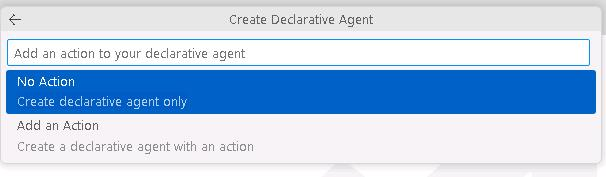
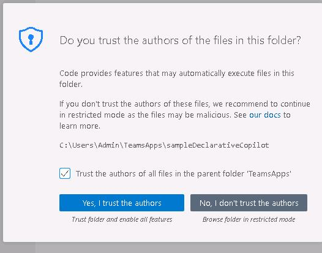
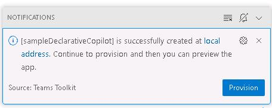
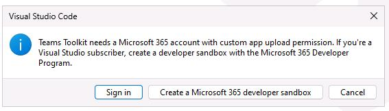
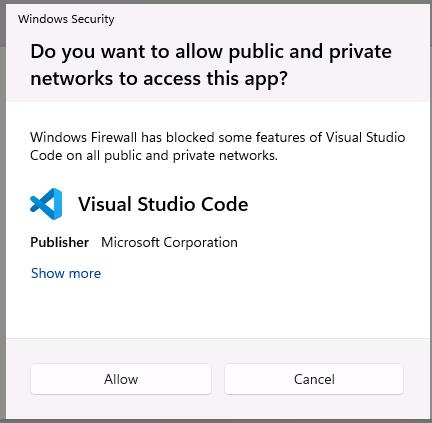
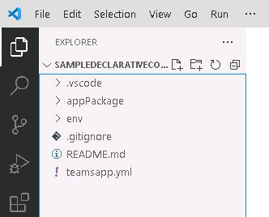
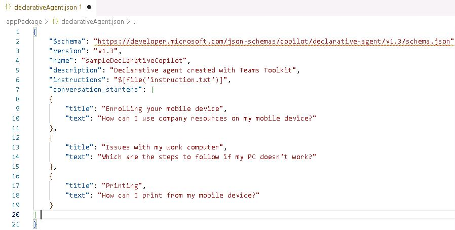
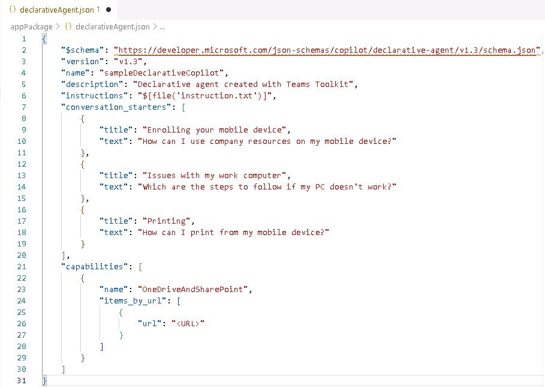
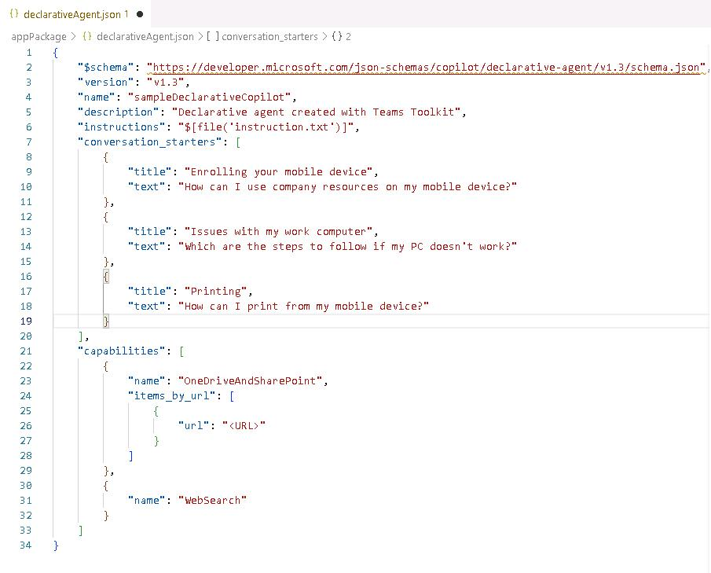

# Task 03: Build and install the declarative agent in Visual Studio Code 

## Introduction

After validating Project Tracker in Copilot Studio, Best For You Organics’s engineering team wants to maintain the agent as source‑controlled code and enrich it with custom conversation starters and data sources. Visual Studio Code with Teams Toolkit provides the scaffolding and manifest editing tools required to achieve this.

## Description

In this task you will create a brand‑new declarative agent project in Teams Toolkit, provision it to the tenant, and then edit the generated declarativeAgent.json manifest to add conversation starters, a SharePoint grounding site, and Web Search capability.

## Success criteria

 - A new Teams Toolkit project named sampleDeclarativeCopilot is successfully created and provisioned.
 - The declarativeAgent.json manifest includes a conversation_starters array with three entries.
 - A OneDriveAndSharePoint capability referencing your Project Deadlines SharePoint URL is added.
 - A WebSearch capability is appended and the manifest formats without errors.

## Key steps

### 01: Scaffold the declarative agent project

<details markdown="block"> 
  <summary><strong>Expand this section to view the solution</strong></summary> 


{: .note }
> If you're using the Skillable environment, the toolkit is preinstalled in Visual Studio Code and is set to automatically update. If you are not using the Skillable environment you may need to install the toolkit. 
>
> To install the toolkit, in the left pane, select **Extensions**. Then, search for **Microsoft 365 Agents Toolkit**. Select **Install**.

1. Open Visual Studio Code. On the left pane, select **Microsoft 365 Agents Toolkit**.

    

1. In the **Microsoft 365 Agents Toolkit** pane, select **Create a New Agent/App** and then select **Declarative Agent**. 

    

1. Select **No Action**.

    

1. Select **Default folder**.

    
 
1. In the **Application Name** field, enter `sampleDeclarativeCopilot` and then press **Enter** on your keyboard. 

    

1. If prompted, select **Yes, I trust the authors**. 

    

1. At the lower right of the page, select the **Notifications** icon. 

    

1. In the current notification, select **Provision**.

    

1. In the Visual Studio Code dialog, select **Sign in**.

    

1. On the web page that opens, in the **Windows Security** dialog, select **Allow**.

    

1. In the **Pick an account** dialog, select your credentials.

1. Close the Visual Studio Code web page and return to Visual Studio Code.

    {: .warning }
    > At the lower right of the page, you may see the notification **Custom app upload is disabled**. The notification will provide options. 
    >
    > If you do not have administrative permissions for your Microsoft 365 tenant, use the **Use Test Tenant** option to configure a test tenant.
    >
    > If you have administrative permissions for your Microsoft 365 tenant, you can configure the **Enable Custom App Upload** option. 
    >
    > Go to the Teams Admin center. In the left pane, select **Teams apps** and then select **Setup policies**. Select the **Global (Org-wide default)** policy and then set **Upload custom apps** to **On**. Select **Save**.
    >
    >  

1. In Visual Studio Code, in the left pane, select **EXPLORER**. Expand **appPackage** to view the files that make up the declarative agent. 

    

1. In EXPLORER, select **manifest.json** and inspect the file contents. 

1. Near line 30, notice the **copilotAgents** section.  

    {: .note }
    > The **copilotAgents** section lists the identifier for the agent and the name of the file that defines the agent.  

1. In **EXPLORER**,  select **instruction.txt** and inspect the file contents. This file contains conversation starters. 

    {: .note }
    > You can customize the tone and how copilot will answer questions like you can with which questions to answer. This allows you to fine tune the experience for your scenario. 


</details> 

### 02: Add a conversation starter 

<details markdown="block"> 
  <summary><strong>Expand this section to view the solution</strong></summary> 

You can customize the declarative Copilot experience by adding conversation starters. You define conversation starters by adding a section to the declarativeCopilot.json file.  

1. In **EXPLORER**,  select **declarativeAgent.json** and inspect the file contents. The file contains entries for the **schema**, **version**, **name**, **description**, and **instructions**. The entry for **instructions** has a reference to a file called instruction.txt. 

1. In Visual Studio Code, open **declarativeAgent.json**. go to line 6, add a comma at the end of the line and then press **Enter** on your keyboard to insert a new line. 

    {: .note }
    > You can customize the declarative Copilot experience by adding conversation starters. You define conversation starters by adding a section to the declarativeCopilot.json file.  

    

1. Enter the following code on the new line to add the conversation starter section: 

    ```JSON-wrap
    "conversation_starters": [ 
        { 
            "title": "Enrolling your mobile device", 
            "text": "How can I use company resources on my mobile device?" 
        }, 
        { 
            "title": "Issues with my work computer", 
            "text": "Which are the steps to follow if my PC doesn't work?" 
        }, 
        { 
            "title": "Printing", 
            "text": "How can I print from my mobile device?" 
        } 
    ] 
    ``` 

    

    {: .note }
    > Once you deploy the agent, the conversation starters will show up as a part of the Copilot experience. 


</details>

### 03: Add a SharePoint data source 

<details markdown="block"> 
  <summary><strong>Expand this section to view the solution</strong></summary> 


1. In declarativeAgent.json, go to line 20. Add a comma at the end of the line and then press **Enter** on your keyboard to insert a new line.  

1. On the new line, add the following code to include a SharePoint data source: 

    {: .warning }
    > Reminder: If you stored the URL in Notepad, replace the token @lab.Variable(URL) with the actual URL of your SharePoint site. 

    ```JSON-wrap
    "capabilities": [ 
        { 
            "name": "OneDriveAndSharePoint", 
            "items_by_url": [  
                { 
                    "url": "@lab.Variable(URL)" 
                } 
            ] 
        } 
    ] 
    ``` 

    

    {: .note }
    > This agent uses data from OneDrive and SharePoint. You have a link to access the data source. Copilot will only focus on information from this site. 

1. Right-click any open area in the code and select **Format Document** to auto-fix the formatting. 


 </details>
 
### 04: Add web search 

<details markdown="block"> 
  <summary><strong>Expand this section to view the solution</strong></summary> 
 

1. In declarativeAgent.json, go to line 29. Add a comma at the end of the line and then press **Enter** on your keyboard to insert a new line.  

 
1. Enter the following code to add web search capabilities: 

 
    ```JSON-wrap
    ,
    { 
        "name": "WebSearch" 
    } 
    ``` 

     

1. Save the changes to **declarativeAgent.json**.

    {: .note }
    > Use the **Ctrl** **S** keyboard combination or go to **File** and select **Save** to save the changes.

</details>
