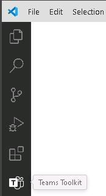
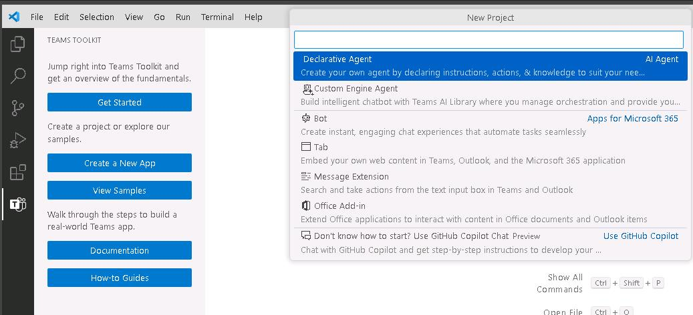
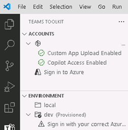

# Task 03: Build and install the declarative agent in Visual Studio Code 

## Introduction

After validating Project Tracker in Copilot Studio, Best For You Organics’s engineering team wants to maintain the agent as source‑controlled code and enrich it with custom conversation starters and data sources. Visual Studio Code with Teams Toolkit provides the scaffolding and manifest editing tools required to achieve this.

## Description

In this task you will create a brand‑new declarative agent project in Teams Toolkit, provision it to the tenant, and then edit the generated declarativeAgent.json manifest to add conversation starters, a SharePoint grounding site, and Web Search capability.

## Success criteria

 - A new Teams Toolkit project named sampleDeclarativeCopilot is successfully created and provisioned.
 - The declarativeAgent.json manifest includes a conversation_starters array with three entries.
 - A OneDriveAndSharePoint capability referencing your Project Deadlines SharePoint URL is added.
 - A WebSearch capability is appended and the manifest formats without errors.

## Key steps

### 01: Scaffold the declarative agent project

<details markdown="block"> 
  <summary><strong>Expand this section to view the solution</strong></summary> 

1. Open Visual Studio Code. On the left pane, select **Teams Toolkit**.

	

1. In the **Teams Toolkit** pane, select **Create a new app** and then select **Declarative Agent**. 

	{: .warning } 
    > If you don't see the **Declarative Agent** option, perform the following steps:
    >
    In Visual Studio Code, in the left pane, select **Extensions**. Uninstall and then reinstall **Teams Toolkit**. The minimum version that supports creating declarative agents is version 5.14.0.

	

1. Select **No Action**.

	

1. Select the **Default folder** location. Enter the name +++sampleDeclarativeCopilot+++ and then select **Enter**. 

1. If prompted, select **Yes, I trust the authors**. 

	

1. At the lower right of the page, select the **Notifications** icon. In the current notification, select **Provision**.

	

1. In the Visual Studio Code dialog, select **Sign in**.

	

1. On the web page that opens, in the **Windows Security** dialog, select **Allow**.

	

1. In the **Pick an account** dialog, select your credentials.

1. Close the Visual Studio Code web page and return to Visual Studio Code.

1. At the lower right of the page, select the **Notifications** icon. If you see the notification **Custom app upload is disabled** notification, select an option.

	

	{: .note }
    > Teams Toolkit requires that the ability to upload custom apps. If you have admin permissions for your Microsoft 365 tenant, you can use the **Enable Custom App Upload** option to configure the environment. If not, use the **Use Test Tenant** option and configure a test tenant.
	>
    > In Visual Studio Code, select **Teams Toolkit** and view the **Accounts** section to see if your environment is ready.
    >
    >

1. In Visual Studio Code, in the left pane, select **EXPLORER**. Expand **appPackage** to view the files that make up the declarative agent. 

	

1. In EXPLORER, select **manifest.json** and inspect the file contents. 

1. Near line 30, notice the **copilotAgents** section.  

    {: .note }
    > The **id** is *declarativeAgent* and the **file** is *declarativeAgent.json*. This file is located in the application package. 

1. In **EXPLORER**,  select **declarativeAgent.json** and inspect the file contents. 

1. Notice that there are entries for the **schema**, **version**, **name**, **description**, and **instructions**.  

1. Notice that the entry for **instructions** has a reference to a file called **instruction.txt**. This file can be located in the **appPackage**. 

1. In **EXPLORER**,  select **instruction.txt** and inspect the file contents. This file is used to house the conversation starters. 

    {: .note }
    > You can customize the tone and how copilot will answer questions like you can with which questions to answer. This allows you to fine tune the experience for your scenario. 

</details> 

### 02: Add a conversation starter 

<details markdown="block"> 
  <summary><strong>Expand this section to view the solution</strong></summary> 

You can customize the declarative Copilot experience by adding conversation starters. You define conversation starters by adding a section to the declarativeCopilot.json file.  

 


1. In Visual Studio Code, open **declarativeAgent.json**. Navigate to line 6, add a comma at the end of the line and then select **Enter** to insert a new line. 

1. Enter the following code on the new line to add the conversation starter section: 


    ```JSON-wrap
    "conversation_starters": [ 
        { 
            "title": "Enrolling your mobile device", 
            "text": "How can I use company resources on my mobile device?" 
        }, 
        { 
            "title": "Issues with my work computer", 
            "text": "Which are the steps to follow if my PC doesn't work?" 
        }, 
        { 
            "title": "Printing", 
            "text": "How can I print from my mobile device?" 
        } 
    ] 
    ``` 

    

    {: .note }
    > Once you deploy the agent, the conversation starters will show up as a part of the Copilot experience. 
</details>

### 03: Add a SharePoint data source 

<details markdown="block"> 
  <summary><strong>Expand this section to view the solution</strong></summary> 

Add the **capabilities** section. 


1. In declarativeAgent.json, navigate to line 20. Add a comma at the end of the line and then select **Enter** to insert a new line.  


1. On the new line, add the following code to include a SharePoint data source: 

    >{: .warning } Reminder: If you stored the URL in Notepad, replace the token @lab.Variable(URL) with the actual URL of your SharePoint site. 

    ```JSON-wrap
    "capabilities": [ 
        { 
            "name": "OneDriveAndSharePoint", 
            "items_by_url": [  
                { 
                    "url": "@lab.Variable(URL)" 
                } 
            ] 
        } 
    ] 
    ``` 

	

    {: .note }
    > This agent uses data from OneDrive and SharePoint. You have a link to access the data source. Copilot will only focus on information from this site. 

1. Right-click any open area in the code and select **Format Document** to auto-fix the formatting. 

    {: .note } 
    > You can install Graph connectors to your Copilot agent by adding an entry to the **capabilities** section as shown below: 
    > 
    >  

 </details>
 
### 04: Add web search 

<details markdown="block"> 
  <summary><strong>Expand this section to view the solution</strong></summary> 
 
1. In **declarativeAgent.json**, navigate to line 29. Add a comma at the end of the line and, then select **Enter** to insert a new line.  

 
1. Enter the following code to add web search capabilities: 

 
    ```
    { 
        "name": "WebSearch" 
    } 
    ``` 

     

1. Save the changes to **declarativeAgent.json**.

</details>