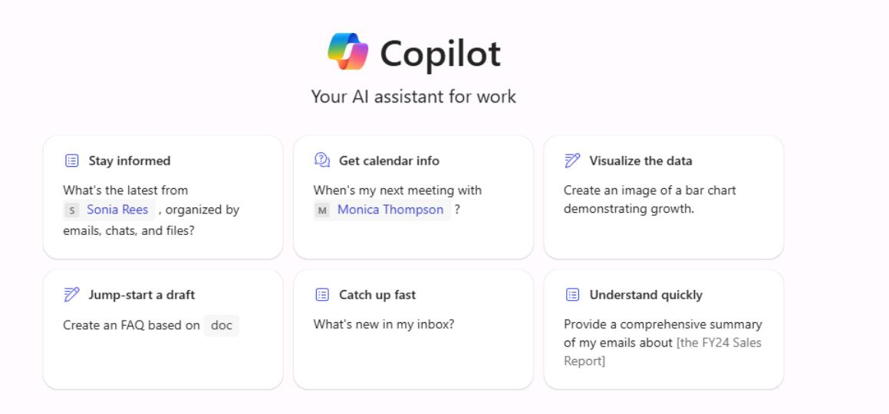
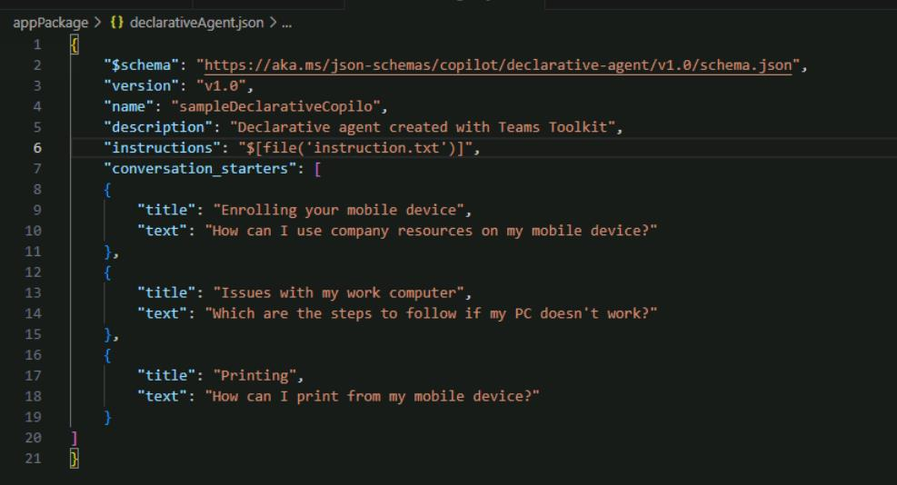
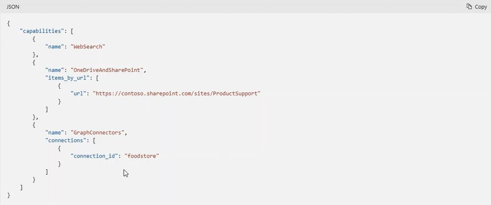

# Task 3 - Build and install the declarative agent in Visual Studio Code 

1. Open Visual Studio Code, on the left pane, select **Teams Toolkit** (Pre-release version). 

1. From **Teams Toolkit**, sign into your M365 account. 

1. In the **Teams Toolkit** options, select **Create a New App**. 

1. Select **Copilot Agent**, select **Declarative Agent**, then select **No plugin**. 

1. Select the **Default folder** location and then enter the name +++sampleDeclarativeCopilot+++ and select **Enter**. 

1. Select **Yes, I trust the authors**. 

1. In the **EXPLORER** pane, expand **appPackage** to view the files that make up the declarative agent: 

1. Select **manifest.json** and inspect the contents. 

1. Near line 30, notice the **copilotExtensions** section.  

    {: .note }
    > The **id** is *declarativeAgent* and the **file** is *declarativeAgent.json*. This file can be found in the appPackage. 

1. In the **EXPLORER** pane, under **appPackage**, select **declarativeCopilot.json** and inspect its contents. 

1. Notice that there are entries for the **schema**, **version**, **name**, **description**, and **instructions**.  

     {: .note
     > Name, description, and instructions are the first way to customize the Copilot in natural language for the declarative agent.  

1. Notice that the entry for **instructions** has a reference to a file called instruction.txt. This file can be located in the **appPackage**. 

1. Select **instruction.txt** to inspect its contents. This file is used to house the conversation starters. 

    ```
    You are a declarative agent and were created with Team Toolkit.  
    You should start every response and answer to the user with "Thanks for using Teams Toolkit to create your declarative agent!\n\n" and then answer the questions and help the user. 
    ``` 

    {: .note }
    > Responses will start with this response. You can customize the tone and how copilot will answer questions like you can with which questions to answer. This allows you to fine tune the experience for your scenario. 

### Add Conversation starter 

 
Other things that you can customize as part of the declarative Copilot experience are the conversation starters. These can be defined by adding a section in the declarativeCopilot.json file.  

 

1. In VS Code, open declarativeCopilot.json. Navigate to line 6, add a comma at the end of the line, then select **Enter** to insert a new line. 

1. Enter the following on the new line to add the conversation starter section: 

    ```
    "conversation_starters": [ 
        { 
            "title": "Enrolling your mobile device", 
            "text": "How can I use company resources on my mobile device?" 
        }, 
        { 
            "title": "Issues with my work computer", 
            "text": "Which are the steps to follow if my PC doesn't work?" 
        }, 
        { 
            "title": "Printing", 
            "text": "How can I print from my mobile device?" 
        } 
    ] 
    ``` 

     

    {: .note }
    > Once deployed, these conversation starters will show up as a part of the Copilot experience. 

 
### Add a SharePoint data source 

Add the **capabilities** section. 

1. In VS Code, open declarativeCopilot.json. Navigate to line 20, add a comma at the end of the line, then select **Enter** to insert a new line.  

1. On a new line, add the following code to include a SharePoint data source: 

    {: .warning }
    > Reminder: If you stored the URL in Notepad, replace the token @lab.Variable(URL) with the actual URL of your SharePoint site. 

    ```
    "capabilities": [ 
        { 
            "name": "OneDriveAndSharePoint", 
            "items_by_url": [  
                { 
                    "url": "@lab.Variable(URL)" 
                } 
            ] 
        } 
    ] 
    ``` 

    {: .note }
    > We’ve chosen to use data from OneDrive and SharePoint. We’ve provided a link to access the data source. Copilot will only focus on information from this site. 

1. Right-click any open area in the code and select **Format Document** to auto-fix the formatting. 

    {: .note }
    > Graph connectors can be installed in a similar fashion.  
    > 
    > Graph connectors knowledge can be added to your declarative Copilot by adding an entry to the **capabilities** section as seen below: 

   
     

 
### Add web search 

 
1. In VS Code, open declarativeCopilot.json. Navigate to line 29, add a comma at the end of the line, then select **Enter** to insert a new line.  

 
1. Enter the following to add web search capabilities for updated information from the internet. This feature is turned off by default but can be turned on by adding the capability entry: 

 
    ```
    { 
        "name": "WebSearch" 
    } 
    ``` 

     
