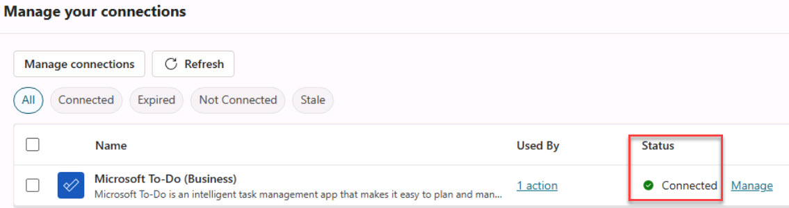

# Task 02 - Publish and test the declarative agent 

1. In the upper-right corner of the page, select **Publish**. 

1. On the **Publish agent** page, review the information and then select **Publish** to make the agent available for testing in the M365 Copilot interface. 

1. Go back to the browser with the **Project Deadline Tracker** agent. 

1. Enter the following prompt to create a task in **Microsoft To-Do** and select **Enter**: 

    ```
    Please create a task in To-Do, in the list called Tasks, to remind me to check TaskMaster Pro deadlines. 
    ``` 

1. Review the response from the agent. Select **Sign in to Project Deadline Tracker** to establish a connection with the **Microsoft To-Do** connector.  

    {: .note }
    > This will open up the connections page in Copilot Studio. 

1. In the right-most column for **Microsoft To-Do (Business)**, select **Connect**. 

1. On the **Create or pick a connection** page, select **Submit** to allow permission for the connection.  

    {: .note }
    > The **Status** column will now display **Connected**. 
    > 
     

1. Return to the browser tab with the **Project Deadline Tracker**, in the upper-right of the page, select **New Chat**. 

1. Re-submit the previous prompt into the chat and select **Enter**: 

    ```
    Please create a task in To-Do, in the list called Tasks, to remind me to check TaskMaster Pro deadlines. 
    ``` 

    {: .note }
    > This time, you'll see a message confirming that a task has been created in your **To-Do** list. 

1. Open the **Microsoft To-Do** application from the same account by opening a new browser tab and going to **[https://to-do.office.com](https://to-do.office.com)**. Sign in if necessary. 

1. On the left pane, select **Tasks**.  

    {: .note }
    > The newly created task will be listed.  

1. Select **Check TaskMaster Pro deadlines** to view the details. 

    {: .important }
    > While this action was performed using a Microsoft product, Copilot Studio supports many third-party platforms through its connectors.   
    > 
    > The main goal of declarative agents and plugins is to help you connect to these platforms and extend Copilot's capabilities. 
