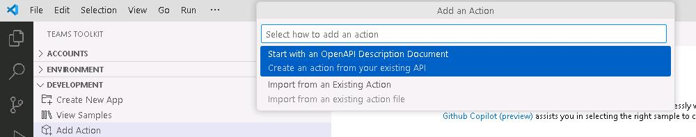
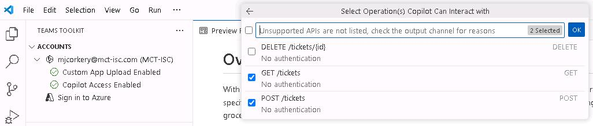
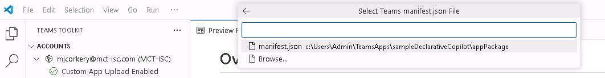

# Task 03: Add an OpenAPI plugin to the Teams Toolkit 

## Introduction
Best For You Organics’s ITSM team uses a bespoke ticketing system. Integrating it will let Copilot surface ticket data in context.

## Description
In this task, you'll learn how to add a plugin to a declarative agent by using the pro-code approach in Visual Studio Code with Teams Toolkit. This approach is critical for extending a declarative agent's capabilities beyond the default Microsoft 365 Copilot features. 

 
While plugins are not part of the core M365 Copilot experience, they are essential for enhancing declarative agents. These agents, customizable to perform specialized tasks, use plugins to interface with external systems, such as APIs. 

 
It's important to note that recent updates to Teams Toolkit have changed how plugins are added. Previously, plugins could be created directly from the Toolkit menu. Now, plugins are added exclusively through declarative agents, offering a more structured and configurable development experience. 

 
Follow these steps and you'll have successfully integrated a plugin into a declarative agent, enabling it to connect with external systems like ticketing platforms: 
 
 - Add an OpenAPI plugin to a declarative agent. 

 - Configure the plugin to interact with a sample API. 

 - Deploy and test the updated declarative agent to confirm functionality. 

## Success criteria

 - ai-plugin_1.json is generated and GET/POST operations are selected.
 - The plugin description is updated to “This plugin can be used to manage IT tickets.”

## Key steps

### 01: Import the OpenAPI description

 <details markdown="block"> 
  <summary><strong>Expand this section to view the solution</strong></summary> 


1. Open Visual Studio Code. 

 
1. In Visual Studio Code, in the left pane, select **EXPLORER**. You should see the files for the agent you created in Exercise 2 Task 3.

 
1. In the left pane, select **Microsoft 365 Agents Toolkit**. 

1. In the left pane, expand the **DEVELOPMENT** node.

1. Select **Add Plugin** and then select **Start with an OpenAPI Description Document**. 

    
 
1. Select **Enter OpenAPI Description Document Location or Open File**. 

1. In the **OpenAPI Description Document** field, enter the following URL and select **Enter**.  

    ``` 
    https://ticket-copilot.azurewebsites.net/api/swagger.json 
    ``` 

    {: .warning }
    > After you press **Enter**, Visual Studio Code will validate the connection. You may see an error about an incompatible connection. This indicates that the API is not currently reachable. 
    >
    > 
    >
    > If you see this error, you have two options:
    >
    > - Instead of entering the URL for the API you can browse to **C:\Users\Admin\Downloads\TicketApi\swagger.json** and use the sample Swagger file. If you use this option, in Task 4 you will not be able to successfully test the agent after publishing it.
    > - Coaches or learners can deploy the API to Azure and share the URL with others. In the @lab.VirtualMachine(CLIENT01).SelectLink VM, In the **Downloads\TicketAPI** folder, read **How to deploy TicketAPI.txt** for more information.

    

1. Select the **GET** and **POST** check boxes and then select **OK**.  This allows Copilot to interact with GET and POST operations.

    

1. Select **manifest.json** from the dropdown list. 

    

<!--
1. Review the informational pop-up window and then select **Add** to finalize adding the plugin. 

    {: .note }
    > The **ai-plugin_1.json** file appears in the **appPackage** folder. 
    >
    > 
-->

</details>

### 02: Update the plugin manifest

<details markdown="block"> 
  <summary><strong>Expand this section to view the solution</strong></summary> 

1. Open the **ai-plugin_1.json** file.  

1. Locate line 5 in the code. Modify the **description_for_human** field by adding the following description: 

    ```description_for_human-wrap-nocolor
    This plugin can be used to manage IT tickets. 
    ```
    
    

1. Review the **GetTickets** section of the code (lines 32-43) for details about how the plugin supports retrieving tickets and creating new tickets.  

    {: .note }
    > The Adaptive Card definition shows how ticket information is displayed. 

1. Scroll down to the **runtimes** section (lines 45-59) and review the code. You can see that the plugin implements the **OpenAPI** specification. 

    {: .note }
    > This specification is included in the project files so that Copilot can understand how the API works. You can find it in: \appPackage\apiSpecificationFile\openapi_1.json 

1. Select **Enter** to save your changes and proceed.

</details>
