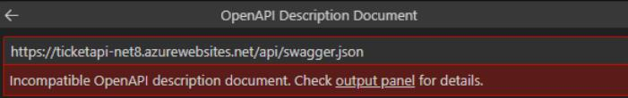

# Task 04 - Deploy and test the declarative agent 

1. Open a new window in VS Code. 

1. Go to the Teams Toolkit extension and create a new App. 

1. Select **Copilot Agent**, select **Declarative Agent**, select **Add plugin**, then select **Start with an OpenAPI Description Document**. 

1. Select **Enter OpenAPI Description Document Location**. 

1. Enter the following URL: **[https://ticketapi-net8.azurewebsites.net/api/swagger.json](https://ticketapi-net8.azurewebsites.net/api/swagger.json)**. 

    {: .warning }
    > Ignore any messages. Try selecting **Enter** again until the connection is successful. 


    

1. Select the **GET** and **POST** options to allow Copilot to interact with GET and POST operations and then select **OK**. 

1. Select the **Default folder**. 

1. Enter **CopilotWithPlugin** for the application name and select **Enter**. 

    {: .note }
    > A new VS Code window should open. If necessary, manually open the folder you just created. If necessary, in the VS code ribbon, select **File** then select **Open Folder** and then go to the location that you saved **sampleDeclarCopilotPlugin** to open it in VS Code. Be sure to select **Yes, I trust the authors** if necessary. 

1. In the **EXPLORER** pane, expand **appPackage** and select **declarativeAgent.json**. 

1. Notice that there’s a new section, the **actions** section. The **id** and **file** entries contain the information for the API plugin. 

1. In the **EXPLORER** pane, select **ai-plugin.json**. 

1. Review the added functions and capabilities that make up the **ai-plugin** manifest. When this Copilot is used, prompts related to tickets will utilize this plugin. 

1. In VS Code, in the left pane, select the **Teams Toolkit** extension, select **LIFECYCLE**, then select **Provision** to push the **CopilotWithPlugin** to M365. 

1. Return to the browser page that is signed into Copilot Microsoft 365 to test the Copilot.  

    {: .note }
    > If necessary, open a new browser tab, go to **[https://m365.cloud.microsoft/chat/](https://m365.cloud.microsoft/chat/)** and sign in. On the left pane, select **Copilot**. 

1. In the right pane, select **CopilotWithPlugin**. 

1. Enter the following in the Copilot prompt to test the plugin and select **Enter**:  

    ```
    Give me the list of tickets assigned to Matteo Pagani 
    ``` 

    {: .note }
    > If there’s a pop-up window, select **Allow All**. 

1. Review the response. 

    - Notice that the response starts with what we set in the instruction.txt file. 

    - Notice the ticket information is accurate.  

    - Notice the reference links to data source pages. 

1. Verify that the Copilot plugin was called by using developer mode.  

    Enter the following into the prompt to enter developer mode and select **Enter**: 

    ```
    -developer on 
    ``` 

1. Re-run the previous prompt and select **Enter**: 

    ```
    Give me the list of tickets assigned to Matteo Pagani 
    ``` 

1. Notice that there’s now a **Show plugin developer info** button.  

 
1. Select **Show plugin developer info** and review the verbose information on the operations. 

 
1. Scroll to the bottom of the section and expand the **Function execution details** and review the full JSON response. 
