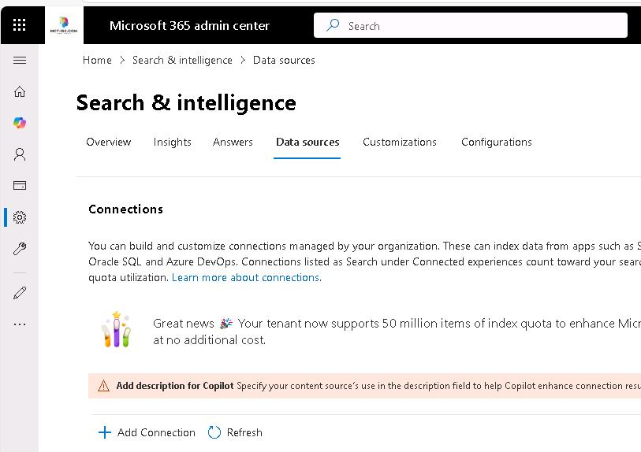
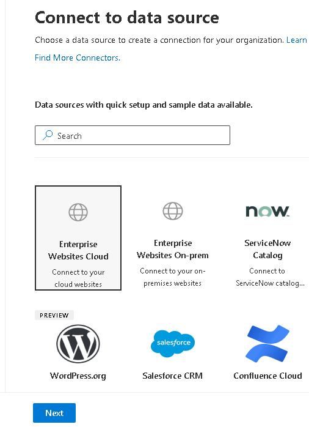

# Task 01: Create a connection to an enterprise website

## Introduction
Support engineers waste time switching to an external knowledge‑base site for DeviceManager Pro. Indexing it with a Graph connector will surface answers directly in Copilot.

## Description
In this task you will create an Enterprise Websites Cloud Graph connector connection that crawls the DeviceManagerPro knowledge‑base site, bringing its articles into Microsoft Search and Copilot for semantic grounding.

## Success criteria
 - DeviceManagerPro KB connector is published and shows Preparing to sync/Ready.
 - Connector description is saved for Copilot grounding.

## Key steps

### 01: Add the connection

<details markdown="block"> 
  <summary><strong>Expand this section to view the solution</strong></summary> 

1. Open a browser and go to **admin.microsoft.com**. 
 
1. Sign in using your Microsoft 365 credentials. 

    {: .note }
    > The roles required to install a Graph Connector are Global Administrator or Search Administrator.

1. On the left menu, select **Show all** > **Settings** and select **Search & intelligence**. 

     
 
1. On the **Search & intelligence** page, select **Data Sources** > **+ Add Connection**. 

    > {: .note }
    Here you'll see the most popular prebuilt Graph connectors. 

	
 
1. Select **Enterprise Websites Cloud**. At the bottom left of the page, select **Next**. 

    

    {: .important }
    > The website you will connect to contains a collection of knowledge base articles about the product Device Manager Pro. Help Desk agents will use this data using Search in Microsoft 365 Copilot to look up information, troubleshoot, and provide solutions to customers experiencing issues with Device Manager Pro. 
 
1. Configure the connection by using the following values and then select **Publish**. Leave all other options at their default values. 

    | Option | Value | 
    |:---------|:---------| 
    | Display name   | **DeviceManagerPro KB**   | 
    | URLs   | **https://ashy-rock-0cd34f10f.5.azurestaticapps.net/**   | 
    | Authentication type   | **None**  | 
    | Notice   | Read the information and select the checkbox   | 

1. In the Success dialog, enter the following text in the **Enhance Copilot responses by adding Connector description** field and then select **Save**:
   
    ```Description-wrap-nocolor
    This Graph connector imports data from DeviceManagerPro Knowledge Base website. The articles are used to help IT professionals and users resolve common issues. 
	```
1. Select **Done**. 

1. The Connections page displays. The value for the Connect state starts as **Preparing to sync** and changes to **Ready** when the initial syncronization process completes. 
 
    {: .warning } 
    > The synchronization operation can take more than 60 minutes to complete.  Continue to **Exercise 5** and come back to complete the remainder of **Exercise 4** once the data sync is complete. 

	{: .note }
    > To check on the status of the sync, select the connector.  
    >
    > - Select **Detail** and expand **Current Crawl** to view current progress. 
    > - Select **Statistics** to get information about what's being indexed.  
    > - Select **Error** to see if any errors were reported during the crawl. 

</details>