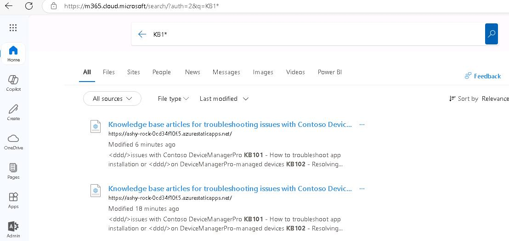

# Task 02: Find information with Search and Copilot prompts 

## Introduction
Once indexed, DeviceManager Pro articles should appear in Microsoft 365 Search and underpin grounded Copilot answers.

## Description
In this task you will verify the connector’s impact by searching for DeviceManagerPro articles in Microsoft 365 and prompting Copilot to generate summaries and suggested prompts based on the indexed content.

## Success criteria
 - Search for KB1* returns KB articles.
 - Copilot suggestions reference the KB and provide useful insights.

## Key steps

### 01: Search indexed KB content

<details markdown="block"> 
  <summary><strong>Expand this section to view the solution</strong></summary> 


1. Open a new browser tab and go to **office.com**. 
 
1. If prompted, sign in by using your credentials. 
 
1. Enter **KB1&#42;** as the prompt and then press **Enter** on your keyboard. If the indexing operation that you started in Task 1 is complete, you should see a series of Knowledge base articles.  

    

    {: .important }
    > If the articles are not found, please continue to the next Exercise and come back once the articles are listed. 

 
1. Select one of the articles. A new browser window opens. You are redirected to a website that shows details for the article. 

1. Return to the **Office.com** web page. In the left pane, select **Copilot**. 

 
1. Enter the following prompt: 

    ```Copilot-wrap-nocolor
    Based on the content of the DeviceManagerPro knowledge base, suggest five Copilot prompts that demonstrate Copilot's ability to reason across data and provide valuable insights or relevant content. 
    ``` 

     

1. Review the suggestions. 

 
1. Enter the first prompt: 
 
    ```Copilot-wrap-nocolor
    What are the common causes and solutions for device enrollment issues in Contoso DeviceManagerPro? 
    ``` 

    {: .important }
    > The prompt requests a step-by-step guide on how to troubleshoot app installation or update issues. It's giving us several references there to help troubleshoot issues, and it's giving us a pointer back to the Knowledge Base article that it's getting from the Graph connector. 

1. Review the results. 

1. Enter the following prompt summarize device enrollment issues and highlight recurring problems: 

    ```Copilot-wrap-nocolor
    Summarize the key steps to resolve device enrollment issues in Contoso DeviceManagerPro and highlight any patterns or recurring problems. 
    ``` 
 
1. Review the results. 

1. Finally, enter the following prompt to draft an email summarizing the articles, with a ranking of severity: 
 
    ```Copilot-wrap-nocolor
    Please draft an email to my manager summarizing the DeviceMangerPro Knowledge base articles, including a ranking of severity as either High, Medium or Low. 
    ``` 

</details>