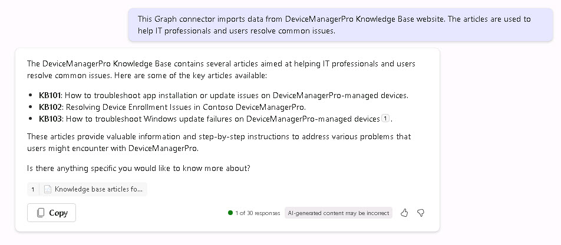

# Task 02 Find information with Search and Copilot prompts 

## Introduction
Once indexed, DeviceManager Pro articles should appear in Microsoft 365 Search and underpin grounded Copilot answers.

## Description
In this task you will verify the connector’s impact by searching for DeviceManagerPro articles in Microsoft 365 and prompting Copilot to generate summaries and suggested prompts based on the indexed content.

## Success criteria
 - Search for KB1* returns KB articles.
 - Copilot suggestions reference the KB and provide useful insights.

## Key steps

### 01: Search indexed KB content

<details markdown="block"> 
  <summary><strong>Expand this section to view the solution</strong></summary> 

1.	Open a new browser tab and go to **office.com**.

1.	Select **Sign in**. If necessary, enter your credentials.

1.	In the search box, enter **KB1&#42;**. The results are articles found in the Device Pro Knowledge Base that's now inside Microsoft 365.

	{: .important }
	> If the articles are not found, please continue to the next Exercise and come back once the articles are listed.

1.	Select one of the articles and notice that it takes you to the website with the the detail of the argument.

</details>

### 02: Try a Copilot prompt 

<details markdown="block"> 
  <summary><strong>Expand this section to view the solution</strong></summary> 

If you want to get started with this new data source. You're going to ask Copilot to suggest the prompts that we should follow up with. 

1. Return to the **Office.com** web page. In the left pane, select **Copilot**. 

1. Enter the following prompt: 

    ```
    Based on the content of the DeviceManagerPro knowledge base, suggest five Copilot prompts that demonstrate Copilot's ability to reason across data and provide valuable insights or relevant content. 
    ``` 

     

1. Review the five suggestions. 
 
1. From the output of the previous prompt, enter the first option: 
 
    ```
    What are the common causes and solutions for device enrollment issues in Best For You Organics' DeviceManagerPro? 
    ``` 

    {: .important }
    > The prompt requests a step by step guide on how to troubleshoot app installation or update issues. It's giving us several references there to help us troubleshoot issues, and it's giving us a pointer back to the Knowledge Base article that it's getting from the Graph connector. 

1. Review the results. 

1. Enter the following prompt summarize device enrollment issues and highlight recurring problems: 

    ```
    Summarize the key steps to resolve device enrollment issues in Best For You Organics DeviceManagerPro and highlight any patterns or recurring problems . 
    ``` 
 
1. Review the results. 

1. Finally, enter the following prompt to draft an email summarizing the articles, with a ranking of severity: 

    ```Copilot-wrap-nocolor
    Please draft an email to my manager summarizing the DeviceMangerPro Knowledge base articles, include a ranking of severity as either High, Medium or Low. 
    ``` 

</details>