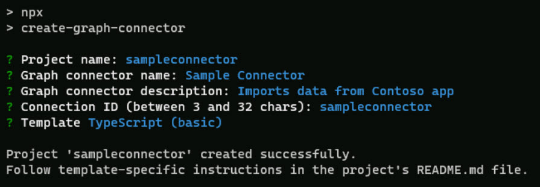
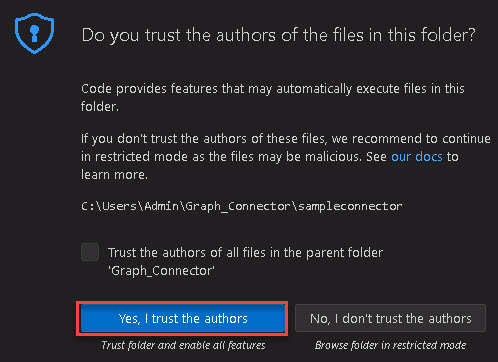
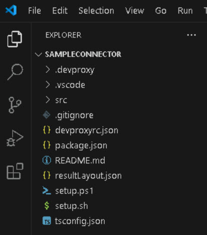

# Task 01: Prepare the environment 

## Introduction
Best For You Organics wants to index proprietary data sources that have no pre‑built connector. Building a custom Graph connector offers full control but requires a TypeScript toolchain.

## Description
In this task you will prepare the node‑based development environment by using npm to globally install the create‑graph‑connector scaffolding utility.

## Success criteria
 - PowerShell reports successful installation of create‑graph‑connector.

## Key steps

### 01: Install the scaffolding utility

<details markdown="block"> 
  <summary><strong>Expand this section to view the solution</strong></summary> 

1. On the taskbar for the @lab.VirtualMachine(CLIENT01).SelectLink virtual machine, right-click **Start** (Windows icon), and select **Terminal (Admin)** to open a PowerShell session with Admin privileges. 
 
    {: .note }
    > Select **Yes** to allow the Terminal app to make changes to your device. 

 
1. At the PowerShell prompt, run the following command. This command installs the *create-graph-connector* package and related tools.

    ```PowerShell-wrap
    npm i - create-graph-connector 
    ``` 
 
1. Change to the **Graph_Connector** directory by running the following command: 

 
    ```PowerShell-wrap
    cd C:\Users\Admin\Graph_Connector 
    ``` 

1. To begin creating the project, run the following command: 

 
    ```PowerShell-wrap
    npm create graph-connector 
    ``` 

1. Select **y** to install any required packages. 

 
1. Configure the *create-graph-connector* project by entering the values in the following table.  

 
  | Item | Value | 
  |:---------|:---------| 
  | Project name:   | **sampleconnector**   | 
  | Graph connector name:   | **Sample Connector**   | 
  | Graph connector description:   | **Imports data from Contoso app**   | 
  | Connection ID (between 3 and 32 chars):   | **sampleconnector**   | 
  | Template   | **TypeScript (basic)**   | 

 
     

 
1. Run the following command to switch the context to the newly created project directory: 

 
    ```PowerShell-wrap
    cd .\sampleconnector\ 
    ``` 

1. Run the following command to open the project in Visual Studio Code (VSCode): 

 
    ```PowerShell-wrap
    code .  
    ``` 

     

1. A new VSCode window will open. Select **Yes, I trust the authors**. Ignore any other pop-up windows. 

     

1. In VSCode, in the left pane, select **Explorer** to view the **SAMPLECONNECTOR** files. 

     

    {: .important }
    > The project that gets created by the template creator is based on TypeScript. All of the code that supports the custom connector is built with TypeScript.  
    > 
    > However, you are not constrained to using TypeScript when creating Graph connectors, you can use any technology that's able to perform HTTP calls. 
    >  
    > Examples of other technologies can be reviewed here: [Graph-Connectors-Samples](https://github.com/pnp/graph-connectors-samples "Graph-Connectors-Samples") and more information on Graph connectors can be found here: [Connectors Gallery](https://learn.microsoft.com/en-us/microsoftsearch/connectors-gallery "Connectors Gallery"). 


</details>