# Task 02: Review the basic building blocks of a Graph connector 

## Introduction
Now that the environment is built, you'll review the basic building blocks of the code that makes up the Graph connector. You'll cover the configuration file, then you'll cover creating the connection to the tenant, next you'll cover the schema, and finally you'll cover transforming and uploading the items. 

## Description

In this task you'll inspect the generated TypeScript project, examining configuration, schema, connection, and ETL modules that together implement a custom Graph connector.

## Success criteria
 - You identified the connector id, baseUrls, and searchResultsTemplates.layout values in config.ts.
 - You identified the connector id, baseUrls, and searchResultsTemplates.layout values in config.ts.
 - You reviewed the properties array in config.ts and can state how each field (e.g., title, url, iconUrl) is mapped and labelled.
 - You followed loadContent.ts and completeJobWithDelayMiddleware.ts and can describe how documents are transformed into external items and uploaded with proper ACLs.

## Key steps

### 01: Review **config.ts** file 

 
  
<strong>Expand this section to view the solution</strong>
 

The config.ts file is a necessary prerequisite for creating a custom Graph connector. Some of the configurations are already injected by properties that you have defined when you created the project.

1. If necessary, expand the **src** folder and select **config.ts** to view its contents. 

1. Review lines 5-7 and verify the values that you entered when creating the project.

   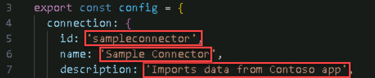

1. Review lines 11-16. **urlToItemResolvers** contains the **baseUrls** array, which tracks if a user is sharing an item that belongs to this Graph connector.

   {: .important }
   > Typically, this is the only configuration that will be modified and its only modified because you need a way to resolve external items with the domain and website where this data can be consumed.

   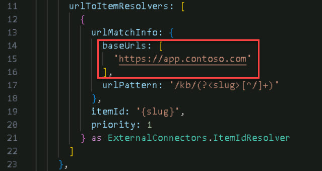

1. Review lines 24-32. **searchResultsTemplates** provides the **id** and **layout**. The **id** is prepopulated because it's tied to the project ID, as seen in line 5. The **layout** is used for rendering content in the search results. 

   {: .important }
   > If you leave **layout** empty, it will use the standard template.

   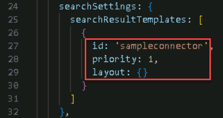

### 02: Review building blocks of creating a connection (calling the API)

 
  
<strong>Expand this section to view the solution</strong>
 

In order to create a custom Graph connector, you must first call an API provided by the Microsoft graph to create a connection and you must supply **config.ts** as a parameter.

1. On the **Explorer** menu, select **createConnection.ts** to view its contents.

1. Review line 6. Notice the **createConnection()** function.

1. The call of the **createConnection()** function can be seen on line 19. We do this by performing an HTTP call from the endpoint of the graph APIs called **'/external/connections'**. We then provide the **id**, **name**, **description**, **activitySettings**, and the **searchSettings** properties as seen on lines 19-26.

   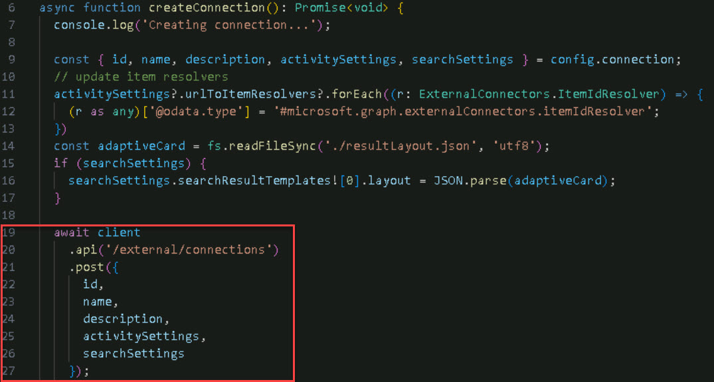

   {: .important }
   > Pre-populated information is coming from the config file except the **adaptiveCard** (line 16) which is loaded from the encoder in the file called **resultLayout.json**.

   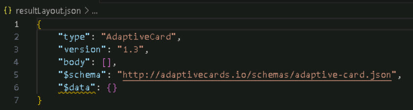

1. On line 19, **client** is an object from the sample template provided by the Microsoft Graph Client Library for TypeScript. It gives you a preconfigured client object to call Microsoft Graph, as seen in lines 8-12 of **graphClient.ts**, and manages authentication.

   >**View of graphClient.ts**
   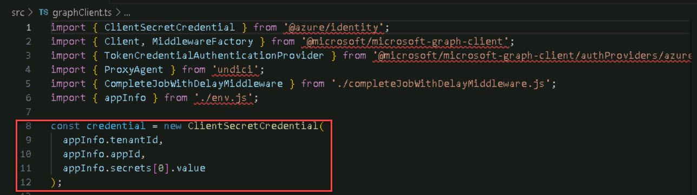

1. Review lines 14-17. The contents of the **createConnections.ts** file are read and parsed as the value of the **layout** property for the search results.
   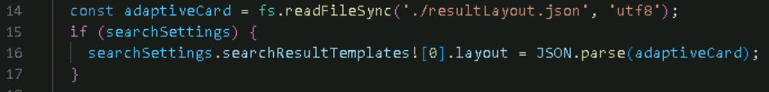

### 03: Review building blocks of creating the Schema 

 
  
<strong>Expand this section to view the solution</strong>
 

After creating the connection, the next step is to define the schema. The schema describes the structure of your external items and the properties you want to bring into the table.

1. On the **Explorer** menu, select **config.ts** and review lines 34-64 to see how the schema is defined. 

1. On line 35, **baseType: 'microsoft.graph.externalItem** represents an entity imported from an external platform.

1. On lines 37-47, **properties:** represent the characteristics of the external item, such as **name**, **title**, **url**, and **iconUrl**. For each property, you can provide details like **type**, **queryable**, **searchable**, **retrievable**, and **labels**. 

   {: .important }
   > These map the information to a property in the M365 tenant. Customize to include all properties you want to import from the external class.

   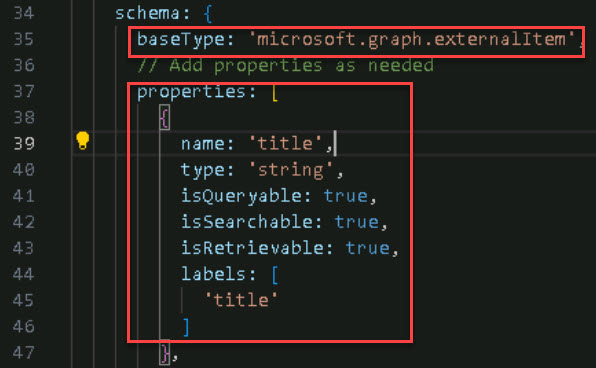

### 04: Recall the Microsoft Graph again  

 
  
<strong>Expand this section to view the solution</strong>
 

After defining the schema, the next step is to call Microsoft Graph again, this time targeting the External connectors endpoint with additional information.

1. In the Explorer menu, select **createConnection.ts** and review lines 32-53 to see how the second API call is made.

1. On line 38, review the addition of the **${ID}** and **/schema** to the connector.

   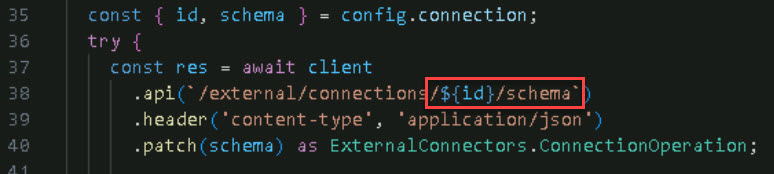

   {: .note }
   > For example, in **config.ts** on line 5, the id is **sampleconnector**.

   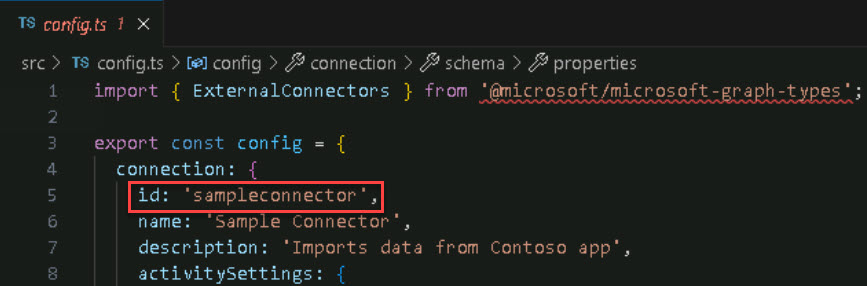

1. On line 40, review **.patch(schema)**, which sends an HTTP PATCH request with the schema data.

1. The schema creation operation can take 5 to 50 minutes. To handle this, **completeJobWithDelayMiddleware.ts** is injected into **graphClient.ts**. Review **completeJobWithDelayMiddleware.ts** for details.

   >**View of graphClient.ts**
   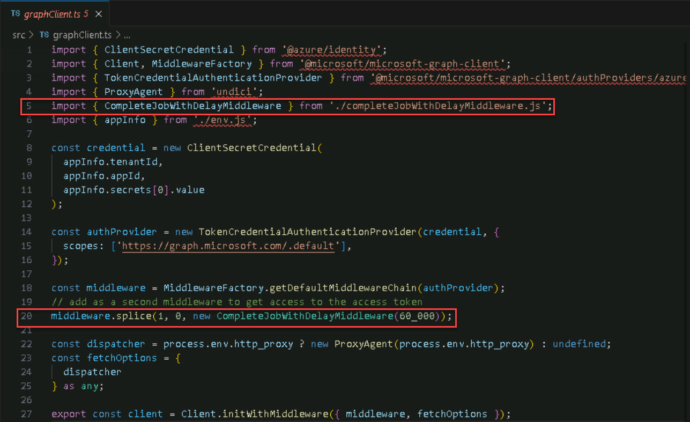

   {: .important }
   > This middleware manages the delay and ensures that content ingestion doesn't start until both the connection and schema are created. 
   >
   > This is important because the final step—uploading external items—can only be performed once the connection and schema are successfully created.

1. The schema creation process in **createConnection.ts** returns an HTTP response with a URL in one of the headers. This URL can be used to query the status of the schema operation.

1. On line 42-53, review the status objects that indicate whether the operation was completed successfully or is still pending.

   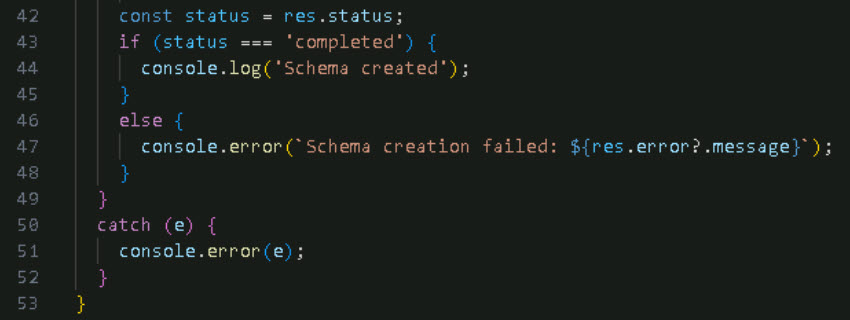

   {: .important }
   > Some objects from the Graph connector SDK simplify these operations. Instead of manually reading the value of the status, you can use **ExternalConnectors.ConnectionOperation** (line 40) to handle this automatically.

### 05: Upload the items

 
  
<strong>Expand this section to view the solution</strong>
 

The final step in creating a custom Graph connector is ingesting content into the tenant. Among the files, **loadContent.ts** requires the most customization. To ingest content, you must take the external content, convert it into external items, and submit it to the tenant. 

The process of converting external content into external item objects varies based on the data source. First, retrieve the items from your data source, then transform them accordingly.

1. In the Explorer menu, select **loadContent.ts**.

1. On lines 6-15, the Document interface represents our item.

   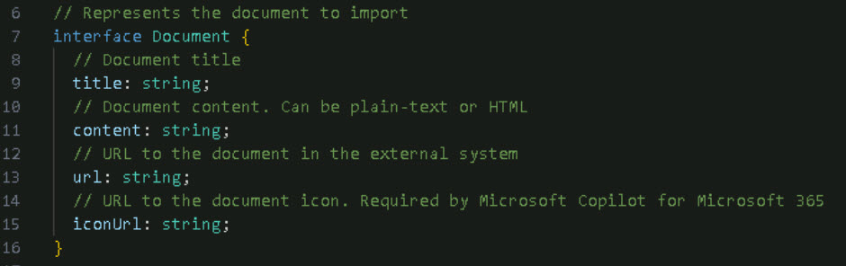

   {: .note }
   > This is a sample template. You would need to update it if there are additional parameters.

1. On lines 18-21, the **extract** function returns a collection of documents. 

   {: .important }
   > This is where you'll query your external data source to retrieve the items you want to import, transforming them into document objects by assigning them to the appropriate properties.

1. On lines 23-29, there's a function that generates a unique ID for each document.

   {: .important }
   > This is crucial because the ID is fundamental for ingesting content into the tenant. It must be unique and link back to the document's URL, allowing URL-to-item resolvers to accurately record activity.

   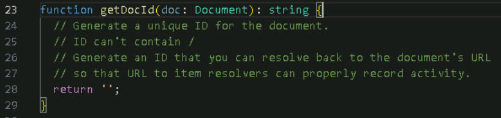

1. On lines 31-55, there's a function that transforms a document into an external item. 

   {: .note }
   > An external item is the Graph object that represents external content being ingested into the tenant.

1. On lines 35-41, the external item is defined by an ID, using the ID of your external content and the properties defined in the schema. (Refer to **config.ts** to see properties like **title**, **url**, and **iconUrl**.)

1. On lines 42-45, the content value and content type are supplied. 

1. On lines 46-52, the function handles the ACL (Access Control List) for the document. 

   {: .important }
   > If you're importing documents from another data source with its own permissions system, you can restrict access to specific groups or users. This prevents the imported documents from being visible to everyone in the M365 tenant.

   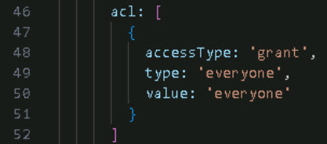

1. On lines 57-73, the code handles the load operation, which is standard as it involves calling Microsoft Graph. 

   {: .important }
   > How it works: 
   >   - For each piece of content in your external platform, this function converts documents into external items. 
   >   - For each external item, the function calls the endpoint **/external/connections/{ID}/items/{uniqueId}** (line 63). 
   >   - It performs an HTTP PUT operation, passing the external item object defined earlier. 
   >   - This operation completes immediately. The for loop (line 59) iterates through each object in the collection and pushes it into the tenant.

1. On lines 79-83, the process starts by extracting content from your external data source (for example, a collection of articles to import). Next, the content is transformed by converting the artifacts into external items, which are entities in Microsoft Graph. Finally, the load function is called to perform the PUT HTTP request against Microsoft Graph to ingest the content.

   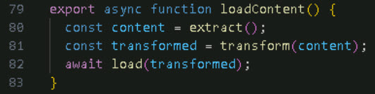

---

### To see more configuration files of the project:

The following information will be used when you set up the connection to the Microsoft Graph client in the **graphClient.ts** file, on lines 8-12.

1. In the Explorer menu, select **package.json**.

1. Review lines 10-13 to see that you can run command-line operations such as **start:createConnection** and **start:loadContent**.

   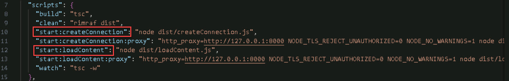

1. On line 19, **devDependencies** is a helper used to set up authentication against Microsoft Graph. 

   {: .note }
   > To use this application, you need to register an application in Microsoft Entra, which will authenticate against the M365 tenant.

1. In the Explorer menu, select and review **setup.ps1** and **setup.sh**.

    - PowerShell: For Windows. Uses M365 CLI to create a new Microsoft Entra App. Defines **name**, **secret**, and **scope**.

    - Bash: For Linux or MacOS. Uses M365 CLI to create a new Microsoft Entra App. Defines **name**, **secret**, and **scope**.

   {: .note }
   > These files are used in **graphClient.ts** lines 8-12.

   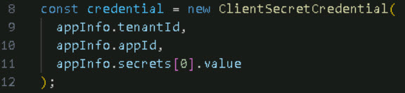

1. Have you completed Exercise 1?

    - If No, go back two pages, verify the connector sync is complete, and finish Exercise 1.
    
    - If Yes, select **Next** to continue.

---
---
# Congratulations! 
### You have completed the TechExcel: Copilot for M365 Extensibility lab.
